# archlinux 系统美化（上篇）

> ### 🌺 爱美之心，人皆有之
>
> 美化这个话题是永恒的。有些人用 Linux 的原因就是一开始被美化后桌面的截图惊艳到了
>
> 这一小节将会介绍如何对 KDE 桌面环境进行美化。受限于篇幅，本小节分为上下篇
>
> 从本章开始，过程将不会讲述的特别细节，根据界面提示操作即可

> ### 🔖 这一节将会讨论：
>
> [[toc]]

需要说明的是，不要过度美化！过度美化可能导致系统稳定性和性能下降等后果。

当然，尊重用户的个人选择，这也是 arch 之道。

本节介绍的步骤建议按顺序进行，**您可以选择在任何一步收手**，因为剩下的步骤可能显得多余，甚至可能适得其反。

同时，本小节将介绍两种桌面布局方式 —— 一种是传统的类似 windows 的菜单栏布局，另一种是类似 macOS 的 Dock 栏布局。

::: tip ℹ️ 提示

若使用虚拟机，请不要过度美化！否则会降低性能甚至卡死。

:::

## 0. 换一张漂亮的壁纸

1. 在桌面右键 > 选择 `配置桌面和壁纸...`

2. 在设置窗口：

   - 选择 `添加图片` > 选择你想要的图片
   - 选择刚才添加的图片 > 点击 `应用`

   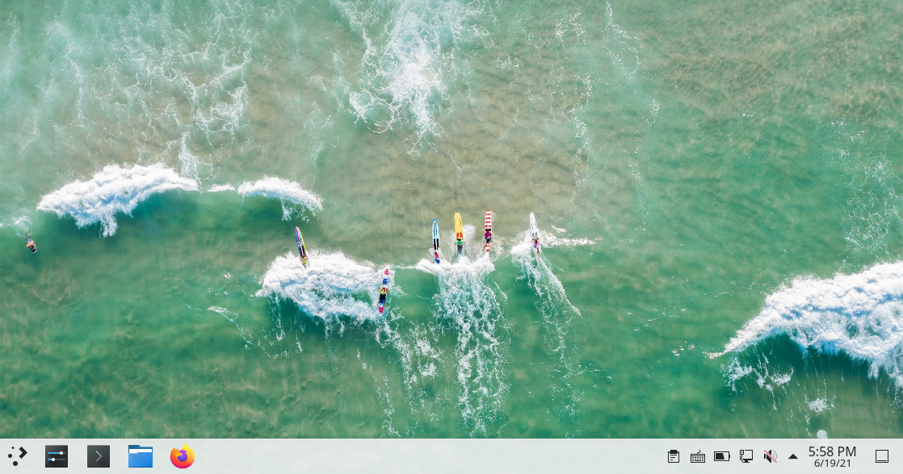

   ::: tip ℹ️ 提示

   `壁纸类型` 可更改为：

   - `幻灯片` —— 若希望壁纸能够定时轮换
   - `每日一图` > 将 `提供` 改为喜欢的来源（如 `必应`，这将和 [必应](https://cn.bing.com) 的背景图片保持一致）

   :::

## 1. 更改系统图标

如果觉得默认的微风主题图标不能满足你的审美，那么可以下载新的图标主题。

1. 安装图标主题：

   - 使用包管理器安装（推荐）

     ::: tip ℹ️ 提示

     推荐使用包管理器安装。

     实际上所有能用包管理器安装的（无论是图标主题、全局主题还是小组件）**都应该用包管理器安装**。

     这样做不仅可以简化安装步骤，还可以将这些东西纳入升级。

     :::

     1. 安装 [`tela-icon-theme`](https://github.com/vinceliuice/Tela-icon-theme)<sup>cn / aur</sup> 图标主题：

        :::: code-group
        ::: code-group-item cn（git）

        ```bash
        sudo pacman -S tela-icon-theme-git
        ```

        :::
        ::: code-group-item aur（git）

        ```bash
        yay -S aur/tela-icon-theme-git
        ```

        :::
        ::: code-group-item aur

        ```bash
        yay -S aur/tela-icon-theme
        ```

        :::
        ::::

        

        ::: tip ℹ️ 提示

        其它图标主题请自行寻找对应包。

        :::

     2. 打开 `系统设置` > 点击侧栏 `外观` > `图标`

     3. 选择刚刚下载好的图标主题 > 点击 `应用`：

        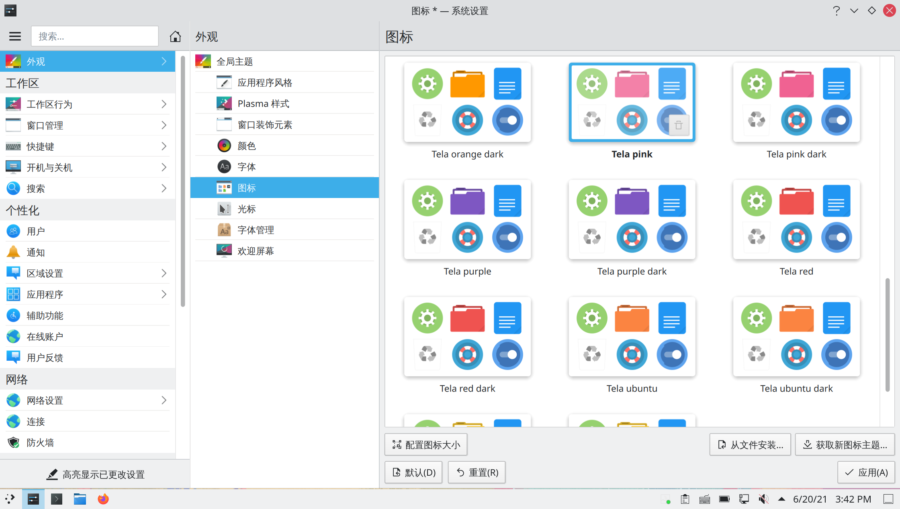

        查看效果：

        

   - 使用 KDE 系统设置安装

     1. 打开 `系统设置` > 点击侧栏 `外观` > `图标` > `获取新图标主题`：

        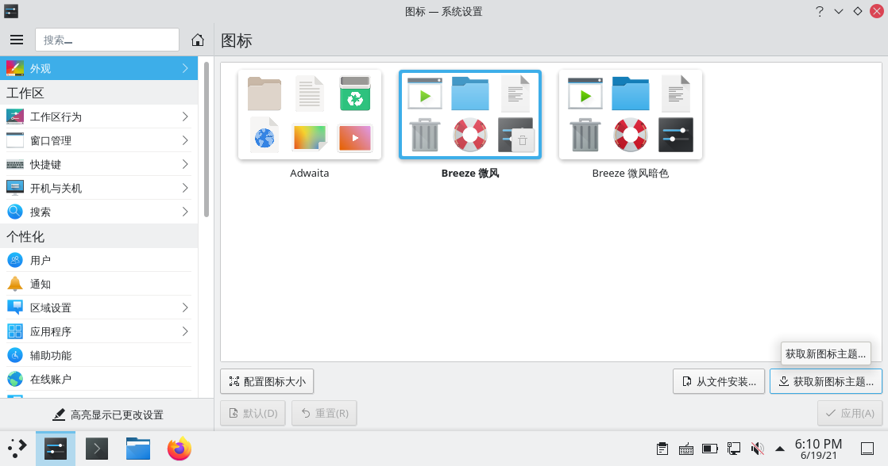

        ::: tip ℹ️ 提示

        为了流畅的连接服务器，你可能需要按照章节 [透明代理](/rookie/transparent.md) 配置透明代理。

        :::

     2. 搜索图标名 `Tela-icon-theme` 或喜欢的一套图标主题 > 点击 `安装` > 选择喜欢的颜色 `安装`：

        

        

     3. 安装完成后点击 `关闭`

     4. 选择刚刚下载好的图标主题 > 点击 `应用`：

        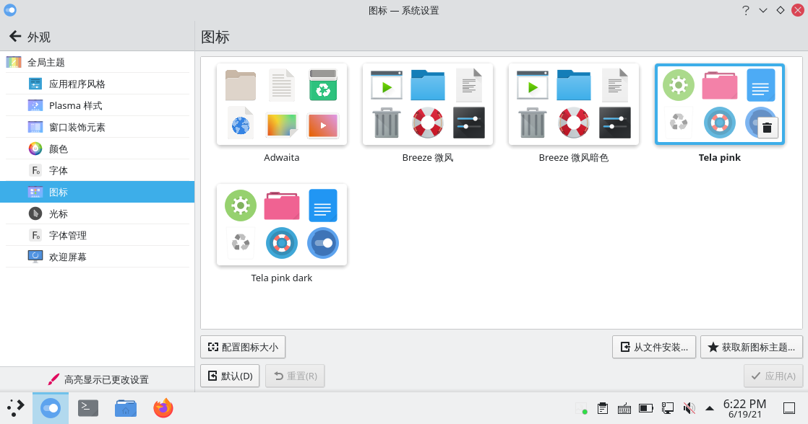

        查看效果：

        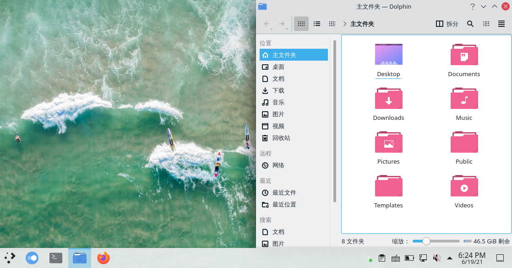

## 2. 更改用户头像

## 2. 确认显示特效混合器（混成器）状态

1. 打开 `系统设置` > 点击侧栏 `显卡与显示器` > `显示特效混合器`

2. 确认显示特效混合器运行状态：

   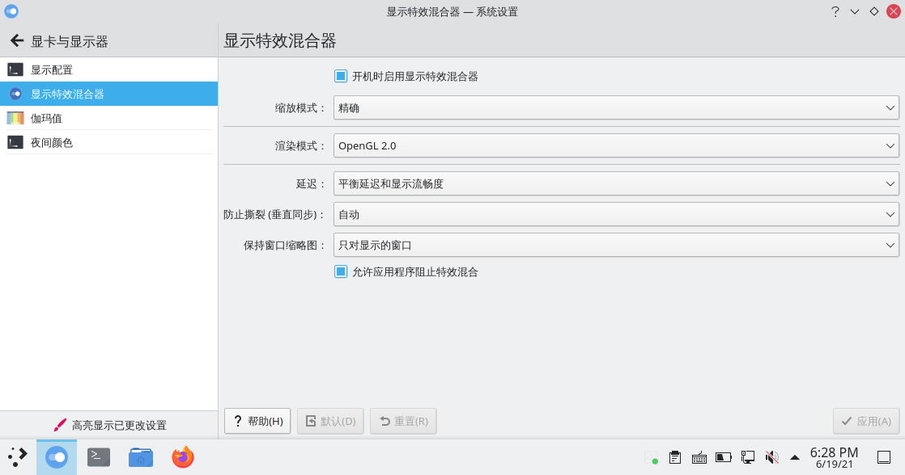

## 3. 设置 SDDM 主题

默认的登录界面不太好看，我们将它替换掉。

1. 打开 `系统设置` > 点击侧栏 `开机和关机` > `登录屏幕（SDDM）`

2. 设置 SDDM 主题：

   - 若希望使用微风 SDDM 主题：

     你可能会发现默认选择的 SDDM 主题就是微风，实际上这只是显示有问题而已。

     1. 随便选择另外一套 SDDM 主题 > 点击 `应用`

     2. 重新选择微风 SDDM 主题 > 点击 `应用`

     3. 重启，查看效果：

        

   - 若希望使用其它 SDDM 主题：

     1. 点击右下角的 `获取新 SDDM 主题...`

     2. 搜索 SDDM 主题名 `McSur-light Sddm Theme` 或喜欢的一套 SDDM 主题 > 点击 `安装`：

        

     3. 安装完成后点击 `关闭`

     4. 选择刚刚下载好的 SDDM 主题 > 点击 `应用` 即可：

        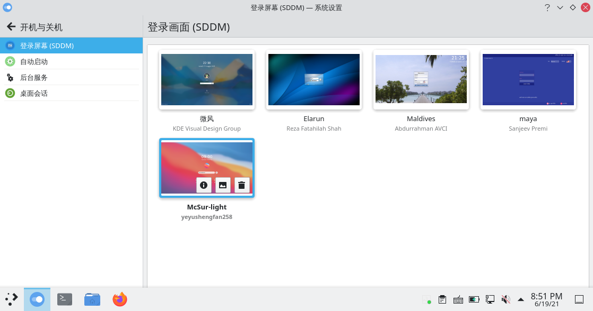

     5. 重启，查看效果：

        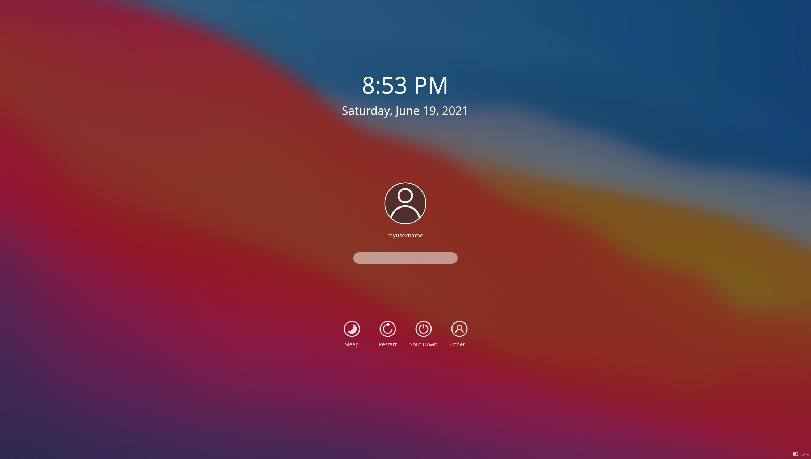

3. 部分 SDDM 主题可以更换背景。点击对应 SDDM 主题中间的图片小图标 > `加载图像文件...` > 选择你想要的图片

4. 点击 `应用`

5. 重启，查看效果：

   

::: tip ℹ️ 提示

若发现 SDDM 显示字体和图标过小，请参阅 [✨ DPI 设置](./optional-cfg-1.md#✨-dpi-设置)。

:::

## 4. 设置欢迎屏幕主题

登录界面后的欢迎屏幕也可以进行美化。

1. 打开 `系统设置` > 点击侧栏 `外观` > `欢迎屏幕` > `获取新欢迎屏幕...`：

   

2. 搜索欢迎屏幕主题名 `Snowy Night Miku` 或喜欢的一套欢迎屏幕主题 > 点击 `安装`：

   

3. 选择刚刚下载好的欢迎屏幕主题 > 点击 `应用` 即可：

   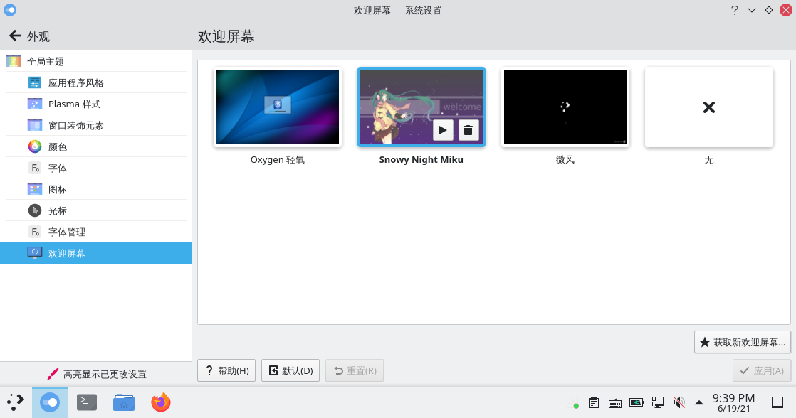

4. 注销，查看效果：

   

## 5. 修改桌面布局

桌面布局之前，需要了解一些基本的概念：

- KDE 桌面中无论是菜单栏还是顶栏，本质上都是**面板**
- 面板上的元素（如托盘图标、数字时钟、网速显示、开始菜单图标）等都是**小组件**
- 小组件可以放置在面板里，也可以独立存在

更改桌面布局，本质上就是**调整面板和小组件的位置以及样式**。

### 5-0. 安装一些小组件

#### Weather Widget

天气插件。相比 KDE 自带的天气插件显示信息更加详细，也不会经常刷新不出天气信息。

安装 [Weather Widget](https://archlinux.org/packages/community/x86_64/plasma5-applets-weather-widget/)<sup>community / aur</sup>：

:::: code-group
::: code-group-item community

```bash
sudo pacman -S plasma5-applets-weather-widget qt5-xmlpatterns # 必须安装
```

:::
::: code-group-item aur（git）

```bash
yay -S aur/plasma5-applets-weather-widget-git qt5-xmlpatterns # 必须安装
```

:::
::::

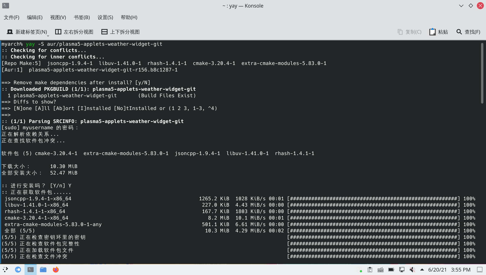

#### Split Digital Clock

放置在桌面的数字时钟。简单配置后可以很好看。

1. 在桌面右键 > 点击 `添加部件`：

   

2. 点击 `获取新部件...` > `下载新 Plasma 部件`：

   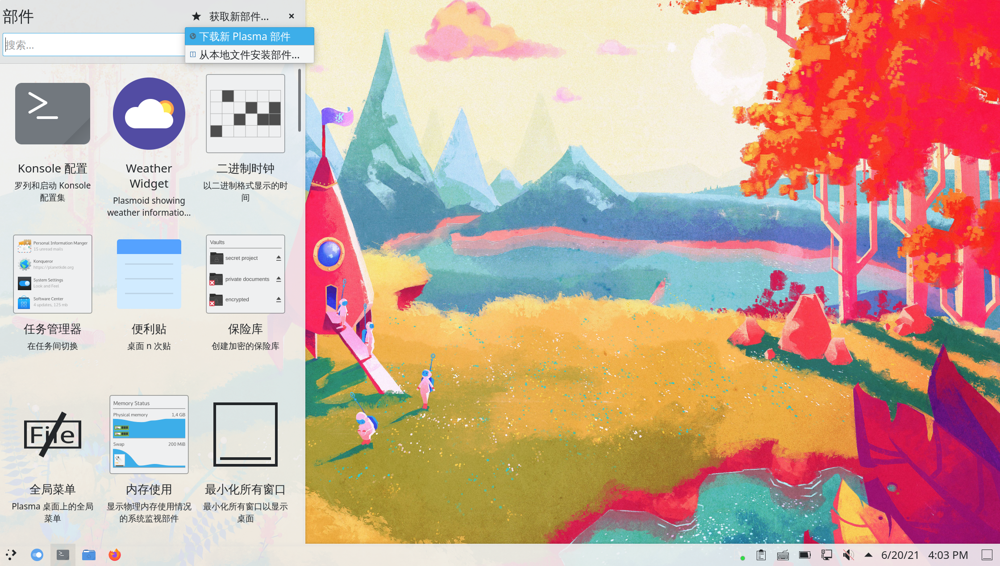

3. 搜索小部件名 `Split Digital Clock` > 点击 `安装`：

   

#### Avalon Menu

程序启动器（开始菜单）。相比 KDE 自带的程序启动器更加简洁大方。

同上，搜索小部件名 `Avalon Menu` > 点击 `安装`：


#### Netspeed Widget

安装 [Netspeed Widget](https://aur.archlinux.org/packages/plasma5-applets-netspeed/)<sup>aur</sup>：

```bash
yay -S plasma5-applets-netspeed
```

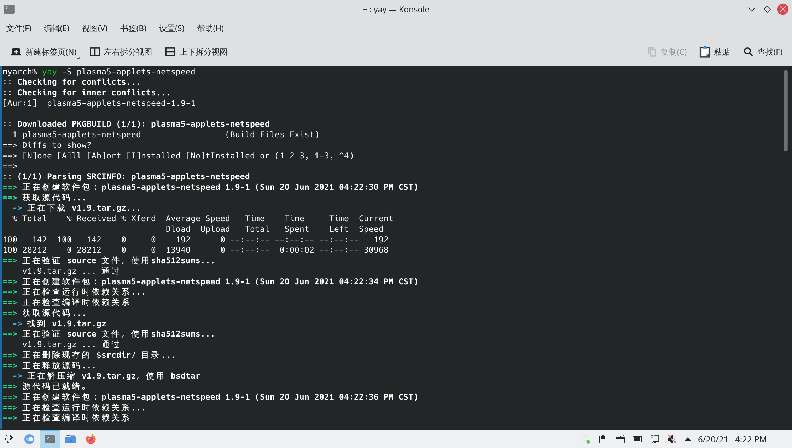

::: tip ℹ️ 提示

其它小部件根据喜好自行安装即可。常用的还有：

- [Simple System Monitor](https://github.com/dhabyx/plasma-simpleMonitor) —— 系统信息

:::

### 5-1. 菜单栏布局

KDE 默认即菜单栏布局。只需调整一下小部件的位置和样式即可。

1. 右键菜单栏 > 点击 `编辑面板...`：

   

2. 点击 `添加部件...` > 将 `Avalon Menu` 拖放至菜单栏左侧：

   

   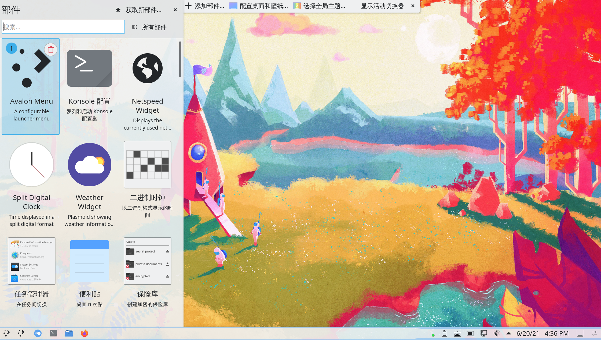

3. 再次 `编辑面板...` > 将光标移动悬停在原来的程序启动器上 > 点击 `移除`：

   

4. 类似的，将 `Netspeed Widget` 和 `Weather Widget` 拖放至合适位置：

   

   ::: tip ℹ️ 提示

   您可能需要调整 `面板高度` 以使得小组件显示符合期望。

   :::

5. 再次 `编辑面板...` > 将光标移动悬停在 `Weather Widget` 上 > 点击 `配置`

6. 将默认的两个城市删掉：

   

7. 进入 [OpenWeather](https://openweathermap.org/) 网站 > 搜索需要显示的城市 > 将网址复制下来：

   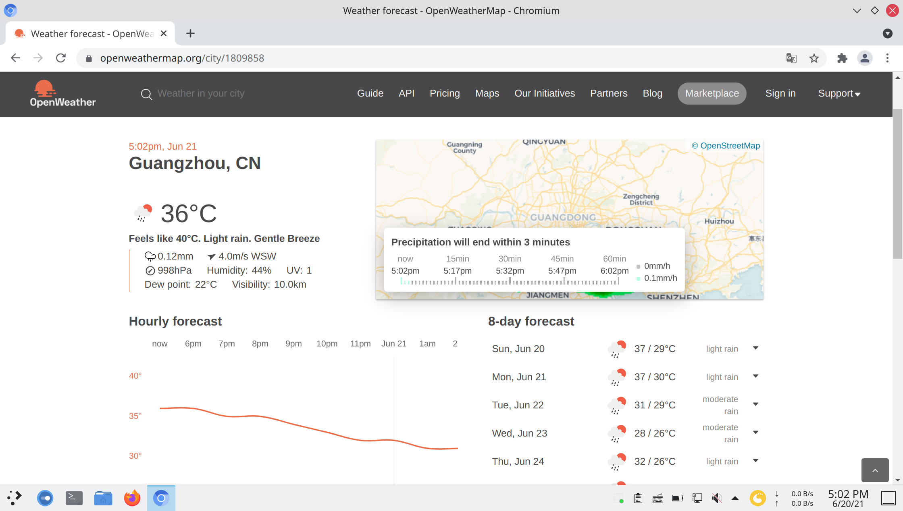

8. 点击 `＋ OWM` > 将复制的网址和城市名称填入 > 点击 `确定` > `应用`：

   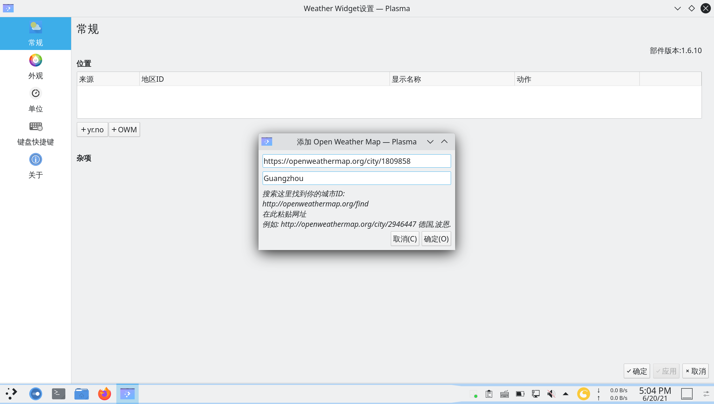

   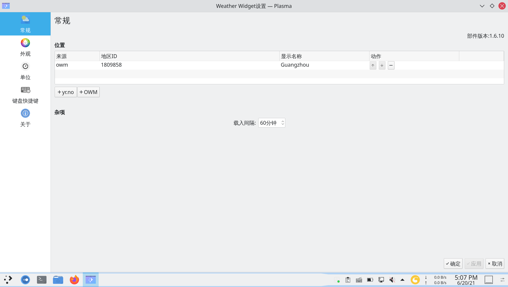

9. 点击侧栏 `外观` > 调整为喜欢的样式 > 点击 `应用`：

   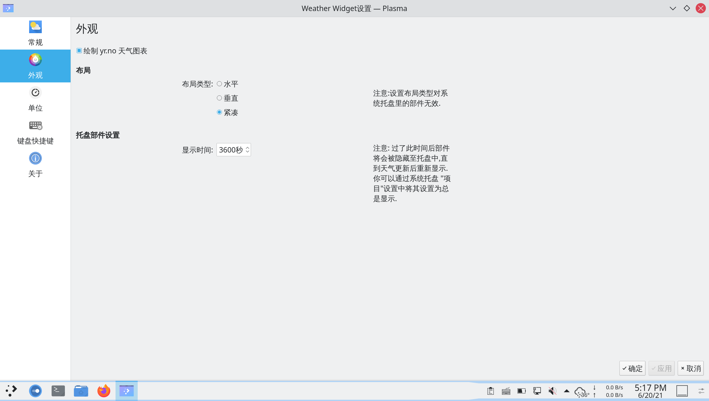

10. 查看效果：

    

### 5-2. Dock 栏布局

1. 为了实现 Dock 栏布局，需要安装 [Latte](https://github.com/KDE/latte-dock)<sup>community / cn / aur</sup>：

   :::: code-group
   ::: code-group-item community

   ```bash
   sudo pacman -S latte-dock
   ```

   :::
   ::: code-group-item cn（git）

   ```bash
   sudo pacman -S latte-dock-git
   ```

   :::
   ::: code-group-item aur（git）

   ```bash
   yay -S aur/latte-dock-git
   ```

   :::
   ::::

   ::: tip ℹ️ 提示

   Latte<sup>community</sup> 已经很久没更新了，并且不支持悬浮。建议安装 Latte<sup>cn / aur </sup>。

   :::

2. 进入 `编辑面板...` > 通过拖拽 `屏幕边缘` 按钮将菜单栏拖拽至底部或左右侧：

   

3. 尝试在终端打开 Latte：

   ```bash
   latte-dock
   ```

   

4. 默认 Latte 已经将自己添加到开机自动启动中了，打开 `系统设置` > 点击侧栏 `开机与关机` > `自动启动` 复查一下：

   

5. 重启，查看效果

6. 右键 Latte 面板 > 点击 `Edit Dock...`：

   

7. 点击 `Advanced` 以启用高级设置：

   

8. 将 `Dock` 更改为 `Panel`：

   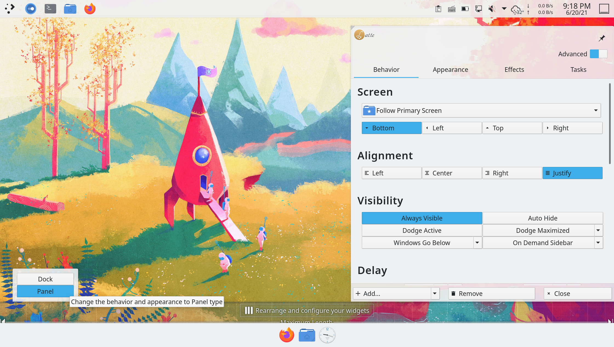

9. 在设置中进行如下更改：

   - 在标签页 `Behavior`（行为）：
     - `Alignment`（对齐）：
       - `Left`（左对齐）
       - `Center`（居中对齐，**推荐设置**）
       - `Right`（右对齐）
       - `Justify`（平铺）
     - `Visibility`（可见性）：
       - `Always Visible`（保持可见，但窗口不会在 Dock 栏下方）
       - `Dodge Active`（避开活动窗口，**推荐设置**）
       - `Windows Go Below`（保持可见，窗口在下方，**推荐设置**）
       - `Auto Hide`（自动隐藏，在鼠标靠近时显示）
       - `Dodge Maximized`（只在全屏显示窗口时隐藏，**推荐设置**）
       - `Dodge All Windows`（有窗口时隐藏）
       - `On Demand Sidebar`（按需隐藏侧边栏，只有当外部程序作用时响应）
       - `Auto Hide Sidebar`（自动隐藏侧边栏，只有当外部程序作用时响应）
   - 在标签页 `Appearence`（外观）：
     - `Items`（项目）：
       - 将 `Zoom on hover`（悬停时缩放比例）调整为 `85%` 或合适大小
     - `Margins`（外边距）：
       - 将 `Screen edge`（屏幕边缘距离）调整为 `8px` 或合适大小
     - `Background`（背景）：
       - 将 `Radius`（圆角）调整为 `16px` 或合适大小

   其它选项保持默认或按需调整即可。

10. 点击 `Close` 完成更改：

    

11. 类似的，右键 Latte 面板 > 点击 `Add Widgets...`（添加小部件） > 将小部件拖拽至合适位置即可

12. 将常用的应用也可以通过拖拽的方式（可能需要先创建快捷方式到桌面）或打开应用之后右键固定项目（`Pin Launcher`）固定到 Latte 面板：

    

    ::: tip ℹ️ 提示

    特别地，若要改变小部件的顺序或配置小部件：

    1. 右键 Latte 面板 > 点击 `Edit Dock...`

    2. 点击 `Rearrange and configure your widgets`（重新排序和配置小部件）

    3. 将光标悬停到对应小部件进行相关操作：

       

    :::

13. 调整顶栏（原菜单栏）的高度，相关小组件位置和样式等。通过点击 `添加间距` 添加两个 `面板间距` 在 `数字时钟` 两侧即可自动使时间居中：

    

### 5-3. 调整细节

1. 配置系统托盘，将不需要的项目隐藏：

   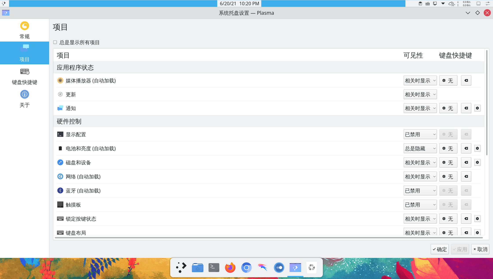

2. 部分应用需要设置为对应的主题模式（暗色 / 亮色）：

   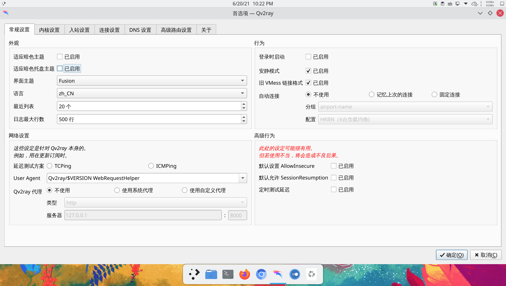
