# 制作系统盘

> ### 🥀 落红不是无情物，化作春泥更护花
>
> 本节介绍在 archlinux 下如何制作系统安装盘（启动盘）以及用来维护的 archlinux 内存系统盘（也就是将 archlinux 安装到 U 盘里）

> ### 🔖 这一节将会讨论：
>
> ::: details 目录
>
> [[toc]]
>
> :::

## 通用方法

### Ventoy（推荐）

[Ventoy](https://www.ventoy.net/cn/index.html)<sup>cn / aur</sup> 是一个制作可启动 U 盘的开源工具。

Ventoy 有诸多优点：

- **无需反复地格式化 U 盘**，只需要把 ISO / WIM / IMG / VHD(x) / EFI 等类型的文件拷贝到 U 盘里面就可以启动了，无需其它操作
- 可以一次性拷贝多个不同类型的镜像文件，Ventoy 会在启动时显示一个菜单来供用户进行选择
- 同一个 U 盘可以同时支持 x86 Legacy BIOS、IA32 UEFI、x86_64 UEFI、ARM64 UEFI 和 MIPS64EL UEFI 模式

Ventoy 支持 [大部分常见类型的操作系统](https://www.ventoy.net/cn/isolist.html)。

安装 Ventoy：

:::: code-group
::: code-group-item cn

```bash
sudo pacman -S ventoy-bin
```

:::
::: code-group-item aur

```bash
yay -S aur/ventoy-bin
```

:::
::::

#### 命令行模式

1. 制作 Ventoy U 盘：

   ```bash
   lsblk # 分辨要安装 Ventoy 的 U 盘
   sudo ventoy -i -g -r size /dev/sdx # 按提示操作即可
   sudo ventoy -l # 显示 U 盘中的 Ventoy 相关信息
   ```

   > 📑 命令参数说明：
   >
   > - `-i` —— 安装 Ventoy 到 U 盘中（如果对应磁盘已经安装了 Ventoy 则会返回失败）
   > - `-g` —— 使用 GPT 分区格式，默认是 MBR 格式
   > - `-r` —— 在 U 盘最后保留部分空间（可选，可以分区并格式化后使用）：
   >   - `size` —— 空间大小（单位是 MB）

   

   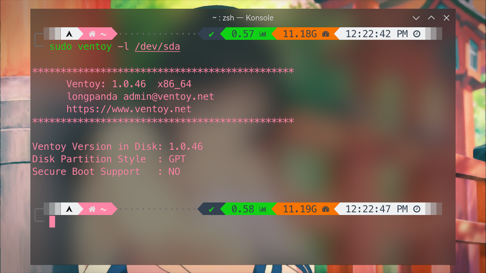

   ::: danger ☢️ 警告

   Ventoy 不会检查输入的设备是 U 盘还是本地硬盘，如果输错了有可能会把系统盘格式化掉！

   :::

   ::: danger ☢️ 警告

   安装 Ventoy 到 U 盘会使 U 盘所有数据丢失，请事先确认。

   :::

   ::: tip ℹ️ 提示

   可用选项 `-I` 强制安装 Ventoy 到 U 盘中：

   ```bash
   sudo ventoy -I -g -r size /dev/sdx
   ```

   可用以下命令升级 U 盘中已经安装好的 Ventoy：

   ```bash
   sudo ventoy -u /dev/sdx
   ```

   :::

2. 拷贝镜像文件到镜像分区（卷标为 `Ventoy`）：

   ```bash
   lsblk # 分辨镜像分区
   sudo mount /dev/sdxn /mnt/mount_point # 挂载镜像分区
   sudo cp /path/of/some_os.iso /mnt/mount_point
   ls -hl /mnt/mount_point # 复查一下
   ```

   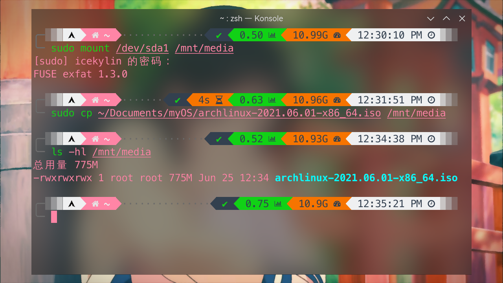

   ::: tip ℹ️ 提示

   你可以将多个镜像文件拷贝到镜像分区。

   :::

   ::: tip ℹ️ 提示

   也可以在 Dolphin 文件管理器中挂载并复制。

   :::

自此，一个支持多系统的安装盘便制作完成了。

::: tip ℹ️ 提示

将 U 盘剩余空间创建新分区并格式化即可使用：

1. 类似 [7-1. 分区](../rookie/basic-install.md#_7-1-分区)，用 `cfdisk` 命令创建新分区。在 `Type` 中选择 `Microsoft 储存空间`（NTFS）：

   ```bash
   sudo cfdisk /dev/sdx
   ```

   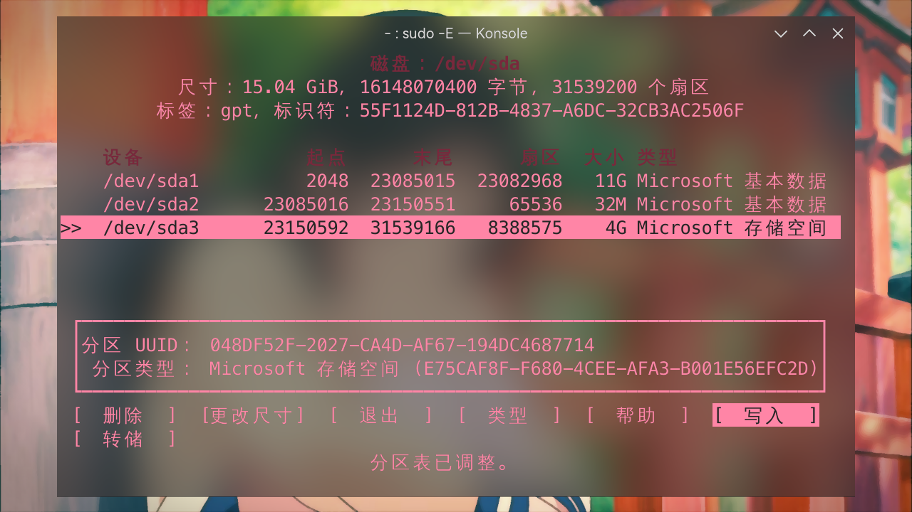

2. 格式化分区：

   ```bash
   sudo mkfs.ntfs -f /dev/sdxn # -f：快速格式化
   ```

   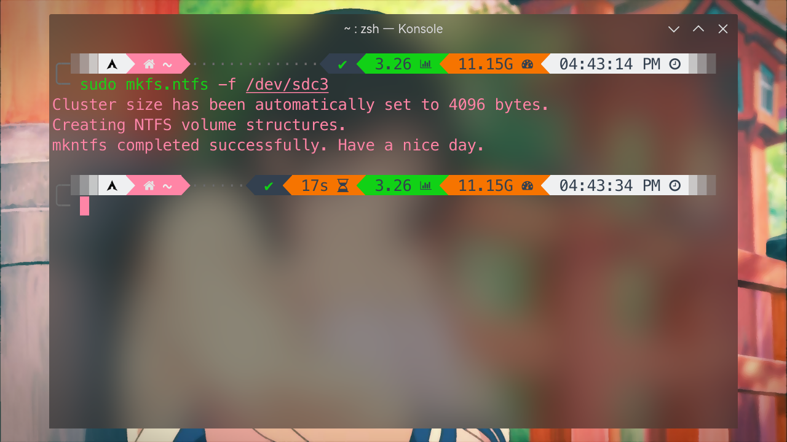

也可以使用图形化的分区工具如 [KDE 分区管理器](https://apps.kde.org/partitionmanager/)。

:::

#### 图形化模式

1. 打开 Ventoy 基于浏览器的图形化操作界面：

   ```bash
   sudo ventoyweb
   ```

   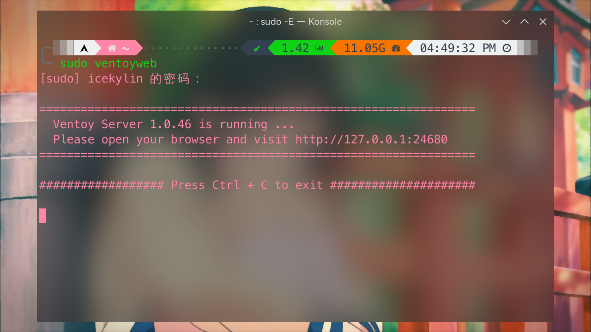

2. 使用浏览器访问提示的本地端口即可：

   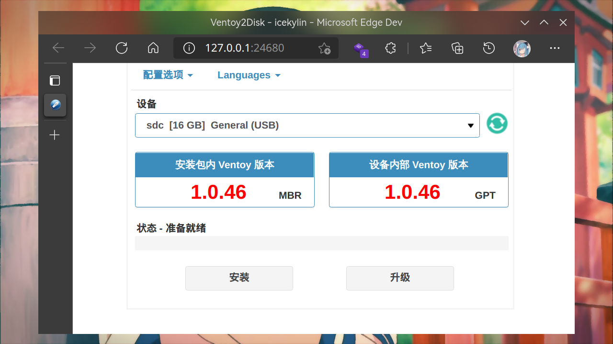

3. 按照界面提示完成操作即可，在终端按下 `Ctrl` + `C` 即可退出

::: tip ℹ️ 提示

目前 Linux 下 Ventoy 图形化模式还不太稳定，有可能制作失败。建议使用命令行模式。

:::

### balenaEtcher

::: tip ℹ️ 提示

此方法**不适用于制作 Windows 安装盘**。

:::

[balenaEtcher](https://www.balena.io/etcher/)<sup>aur</sup> 界面更加傻瓜一点。但是只支持对单个完整 U 盘进行制作，即使还有剩余的空间也无法使用。

1. 安装 balenaEtcher：

   :::: code-group
   ::: code-group-item aur

   ```bash
   yay -S etcher-bin
   ```

   :::
   ::: code-group-item aur（git）

   ```bash
   yay -S etcher-git
   ```

   :::
   ::::

   

   ::: tip ℹ️ 提示

   [`balena-etcher`](https://aur.archlinux.org/packages/balena-etcher) 打开后会白屏，无法正常使用。

   请安装 [`etcher-bin`](https://aur.archlinux.org/packages/etcher-bin/) 或 [`etcher-git`](https://aur.archlinux.org/packages/etcher-git/)。

   :::

2. 打开 balenaEtcher，按提示操作即可：

   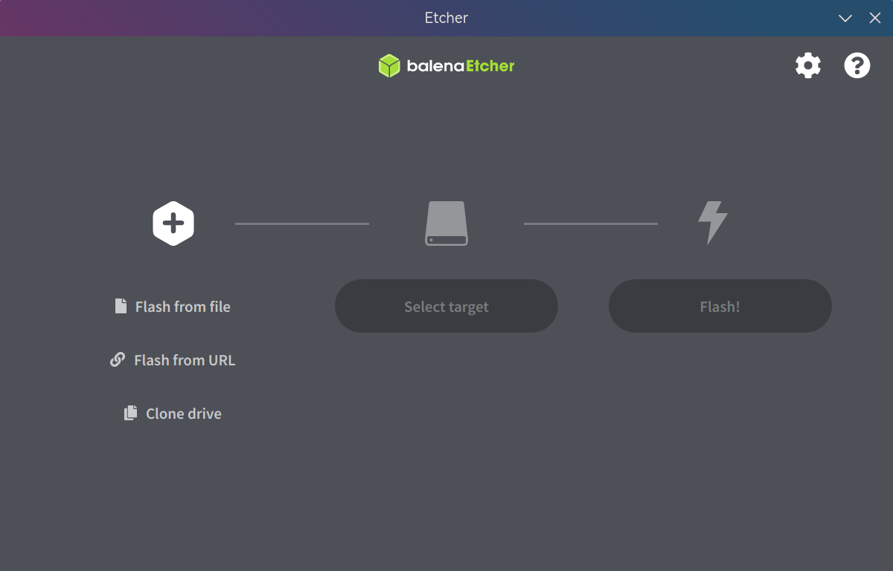

::: tip ℹ️ 提示

使用 balenaEtcher 制作完成的安装盘若要重新作为普通 U 盘使用，需要用磁盘分区管理工具（如 [KDE 分区管理器](https://apps.kde.org/partitionmanager/)、[DiskGenius](https://www.diskgenius.cn/)<sup>EULA</sup>）重建分区表才能正常格式化。

:::

## 手动制作

### dd 命令

::: tip ℹ️ 提示

此方法**不适用于制作 Windows 安装盘**。

:::

`dd` 命令用于读取、转换并输出数据。

使用 `dd` 命令即可简单的制作 Linux 的安装盘。注意 `of` 的参数为 `sdx`，不是 `sdx1`、`sdx2` 等：

```bash
sudo dd bs=4M if=/path/of/some_os.iso of=/dev/sdx status=progress oflag=sync
```

> 📑 命令参数说明：
>
> - `bs=4M` —— 指定一个较为合理的文件输入输出块大小
> - `status=progress` —— 用来输出刻录过程总的信息
> - `oflag=sync` —— 用来控制写入数据时的行为特征。确保命令结束时数据及元数据真正写入磁盘，而不是刚写入缓存就返回

::: danger ☢️ 警告

此步骤会使 U 盘所有数据丢失，请事先确认。

:::

::: tip ℹ️ 提示

此时 U 盘应该未挂载。若已经挂载了请先卸载掉：

```bash
sudo umount /mnt/mount_point
```

:::

### win10 / win11 安装盘

以往在 Linux 下手动制作一个 win10 / win11 安装盘还是很简单的，但是随着近几年微软的更新，其 iso 安装镜像中存在一个名为`install.wim`的文件，其大小已经超出了 4GB（fat32 要求的单个文件最大 4GB）的限制。这使得必须用额外的步骤才能制作一个启动盘。

这里依旧使用 fat32 格式是因为其兼容性是最好的，NTFS 的 UEFI 安装盘很多情况下不被识别。

1. 首先用 `parted` 命令创建 U 盘的分区：

   ```bash
   sudo parted /dev/sdx # 执行 parted，进行磁盘类型变更
   (parted) mktable # 输入 mktable
   新的磁盘卷标类型？ gpt # 输入 gpt，将磁盘类型转换为 GPT 类型。如磁盘有数据会警告，输入 Yes 即可
   (parted) quit # 退出 parted 命令行交互
   ```

   

   ::: danger ☢️ 警告

   重建分区表会使 U 盘所有数据丢失，请事先确认。

   :::

   ::: tip ℹ️ 提示

   也可以使用图形化的分区工具如 [KDE 分区管理器](https://apps.kde.org/partitionmanager/)。

   :::

2. 接下来类似 [7-1. 分区](../rookie/basic-install.md#_7-1-分区)，用 `cfdisk` 命令创建新分区。在 `Type` 中选择 `Microsoft 基本数据`：

   ```bash
   sudo cfdisk /dev/sdx
   ```

   

3. 接下来使用 `mkfs.vfat` 命令格式化所创建的分区，这样 U 盘就准备好了：

   ```bash
   sudo mkfs.vfat /dev/sdxn
   ```

   

4. 接下来下载 win10 / win11 的 iso 镜像并解压。由于 Ark 尚不支持 UDF 文件系统的 ISO 文件，我们需要手动挂载并将其中的内容复制出来：

   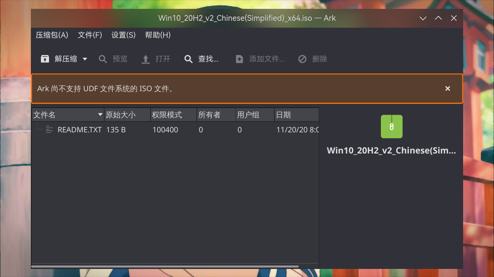

   ```bash
   sudo mount -o loop /path/of/windows_iso_name.iso /mnt/mount_point
   cp -a /mnt/mount_point /path/of/some_folder
   ```

   

5. 得到复制出来的文件后，最后要进行的就是压缩 `install.wim` 文件（在 `sources` 文件夹下）。这里需要首先安装一个包 [`wimlib`](https://archlinux.org/packages/community/x86_64/wimlib/)（可能已经作为依赖安装了）：

   ```bash
   sudo pacman -S wimlib
   ```

6. 接下来进行压缩。这一步会持续较长时间，耐心等待。完成后可以看到文件已经被压缩到了 3.x GB：

   ```bash
   cd /path/of/some_folder/sources
   sudo wimlib-imagex optimize install.wim --solid
   ls -hl install.wim
   ```

   

7. 最后把全部文件复制到 U 盘中即可：

   ```bash
   sudo umount /mnt/mount_point # 卸载掉镜像
   sudo mount /dev/sdxn /mnt/mount_point # 挂载 U 盘
   sudo cp -r /path/of/some_folder/* /mnt/media # 复制全部文件
   ```

   

8. 复查一下并卸载 U 盘：

   ```bash
   ls -hl /mnt/mount_point # 复查一下
   sudo umount /mnt/mount_point # 卸载 U 盘
   ```

   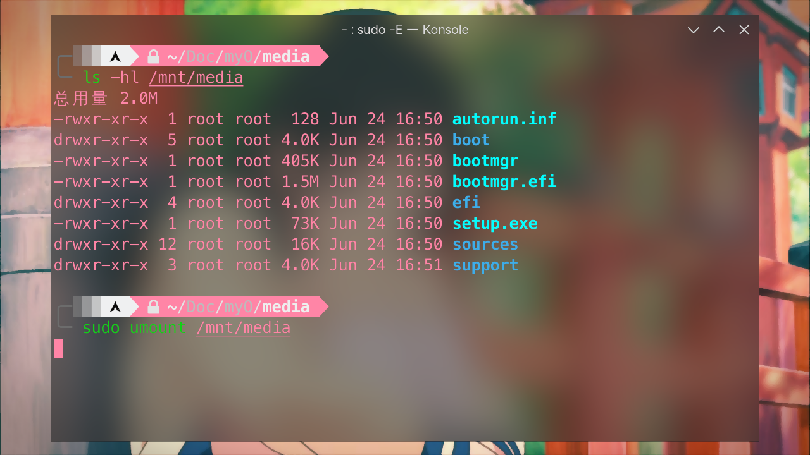

自此，一个 win10 / win11 安装盘便制作完成了。

## 制作 archlinux 内存系统盘

::: warning ⚠️ 注意

此处内容待核实。

:::

> 🔗 相关链接：
>
> 如有需要可参阅 [archWiki 相关内容](<https://wiki.archlinux.org/title/Archiso_(%E7%AE%80%E4%BD%93%E4%B8%AD%E6%96%87)>)。

[Archiso](https://archlinux.org/packages/extra/any/archiso/)<sup>extra / aur</sup> 是自动化制作最新版 archlinux 镜像的工具集，可用于制作定制化的 archlinux 镜像。

### 1. 准备工作

1. 首先安装 Archiso 相关包：

   :::: code-group
   ::: code-group-item extra

   ```bash
   sudo pacman -S archiso
   ```

   :::
   ::: code-group-item aur（git）

   ```bash
   yay -S archiso-git
   ```

   :::
   ::::

   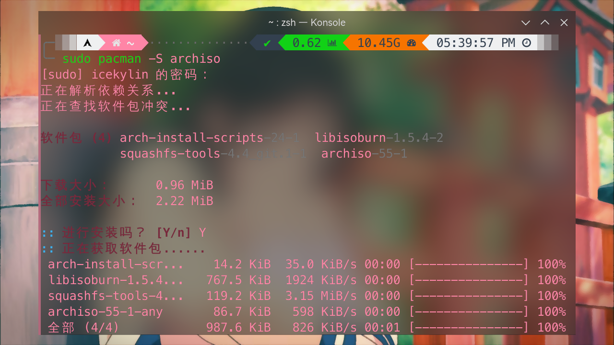

2. 复制 `releng` 配置方案到合适位置：

   ```bash
   sudo cp -r /usr/share/archiso/configs/releng /path/of/some_folder/archlinux_live
   cd /path/of/some_folder/archlinux_live # 进入目录
   ```

   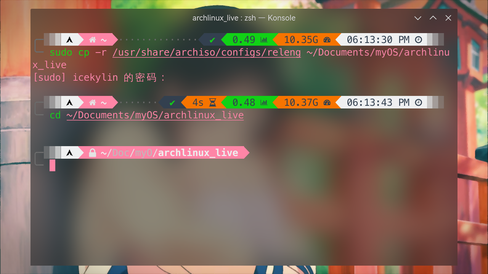

   ::: warning ⚠️ 注意

   务必使用 root 权限操作（使用 `sudo` 提权），否则可能造成问题。

   :::

   ::: tip ℹ️ 提示

   Archiso 提供了两种配置方案：

   - `baseline` —— 只包含基本系统（只包括从介质启动实时环境所需的最低限度的软件包）
   - `releng` —— 可以制作定制镜像（用于创建正式的每月安装镜像，可以作为创建自定义镜像的起点）

   显然，这里我们使用 `releng` 配置方案。

   :::

### 2. 进行定制

首先了解下各个文件的用途：

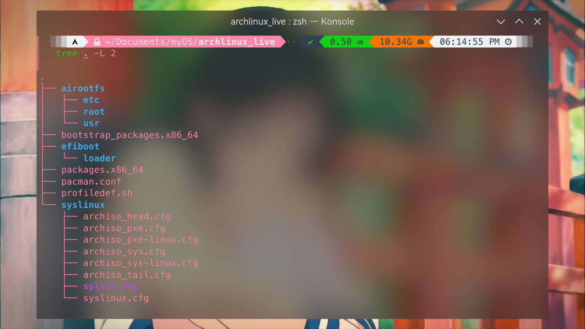

- `packages.x86_64` —— 一份要安装在 Live 系统镜像的软件包列表，一行一个
- `pacman.conf` —— Pacman 的配置文件
- `airootfs` —— Live 系统的 rootfs（根文件系统，遵循 rootfs 的目录规则）。除了安装的包之外，其它的定制（包括启动执行脚本等）都在这里
- `efiboot` / `syslinux` —— 用于设置 BIOS / EFI 启动的配置

1. 编辑 `pacman.conf` 配置文件：

   ```bash
   sudo vim /path/of/some_folder/archlinux_live/pacman.conf
   ```

   在文档结尾处加入下面的文字，来添加 `archlinuxcn` 源。推荐的镜像源（选一个即可）也一并列出：

   ```conf {2}
   [archlinuxcn]
   Server = https://mirrors.ustc.edu.cn/archlinuxcn/$arch # 中国科学技术大学开源镜像站
   Server = https://mirrors.tuna.tsinghua.edu.cn/archlinuxcn/$arch # 清华大学开源软件镜像站
   Server = https://mirrors.hit.edu.cn/archlinuxcn/$arch # 哈尔滨工业大学开源镜像站
   Server = https://repo.huaweicloud.com/archlinuxcn/$arch # 华为开源镜像站
   ```

   去掉 `[multilib]` 一节中两行的注释，来开启 32 位库支持：

   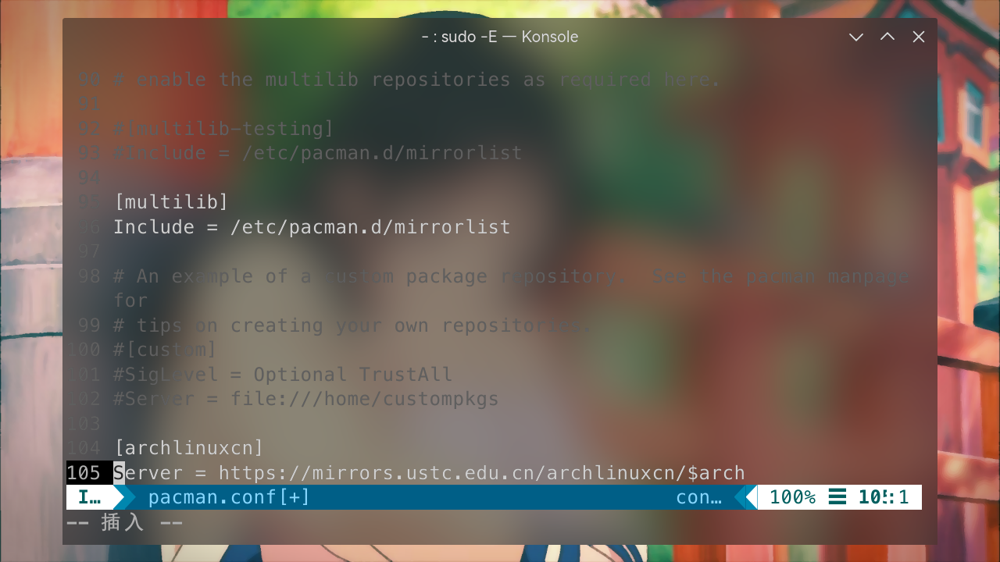

2. 然后修改 `packages.x86_64`：

   ```bash
   sudo vim packages.x86_64
   ```

   在文档结尾处加入 `archlinuxcn-keyring` 和其它需要预安装的包（根据喜好自定义）：

   ```bash
   # custom
   archlinuxcn-keyring
   htop # 系统监控与进程管理软件（top 的升级版）
   bashtop # 系统监控与进程管理软件（top 的豪华升级版）
   iftop # 流量监控工具
   iotop # 磁盘 I/O 监控工具
   ipmitool # 用于管理和配置，支持智能平台管理接口（IPMI）1.5 版和 2.0 版规范的设备的实用程序（给运维用的）
   neofetch # 打印系统信息
   plasma-meta
   konsole
   dolphin
   ntfs-3g
   partitionmanager # KDE 分区管理器
   adobe-source-han-serif-cn-fonts
   wqy-zenhei
   noto-fonts
   noto-fonts-cjk
   noto-fonts-emoji
   noto-fonts-extra
   firefox
   ark
   gwenview
   yay
   timeshift
   mesa
   lib32-mesa
   vulkan-intel
   lib32-vulkan-intel
   cowsay
   ```

   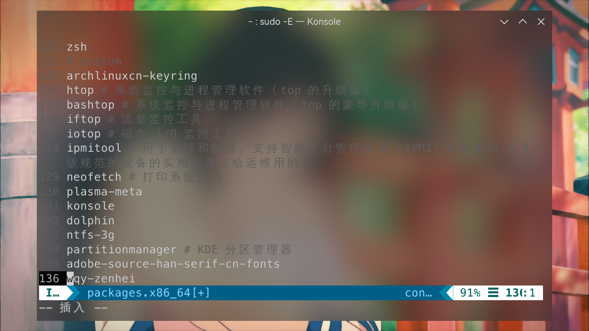

3. 可选向镜像里添加文件：

   - `airootfs` —— 看作是 Live 系统上的 '/' 根目录，在此中存放文件将覆盖或复制到对应的位置
   - `airootfs/etc/skel` —— 在 root 用户主目录里放置文件的方法有些许不同。不要把它们放在 `airootfs/home`，而是放置在此处

   以 `/root/.zshrc` 为例：

   ```bash
   sudo mkdir /path/of/some_folder/archlinux_live/airootfs/etc/skel
   sudo vim /path/of/some_folder/archlinux_live/airootfs/etc/skel/.zshrc
   ```

   

   添加以下内容：

   ```bash
   echo 'archlinux 简明指南' | cowsay
   ```

   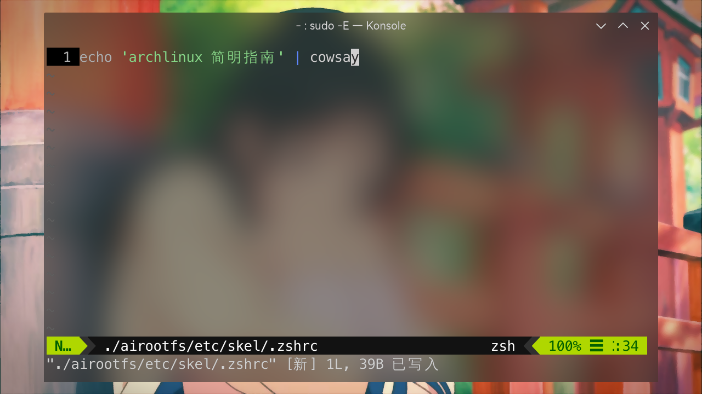

   > #### 🔗 相关链接
   >
   > 如有需要可参阅 [archWiki 相关内容](<https://wiki.archlinux.org/title/Archiso_(%E7%AE%80%E4%BD%93%E4%B8%AD%E6%96%87)#%E5%90%91%E6%98%A0%E5%83%8F%E9%87%8C%E6%B7%BB%E5%8A%A0%E6%96%87%E4%BB%B6>)。

4. 配置登录管理器：

   1. 启用登录管理器的 systemd 服务来做到在引导时启动 X：

      ```bash
      sudo ln -s /usr/lib/systemd/system/sddm.service /path/of/some_folder/archlinux_live/airootfs/etc/systemd/system/display-manager.service
      ```

      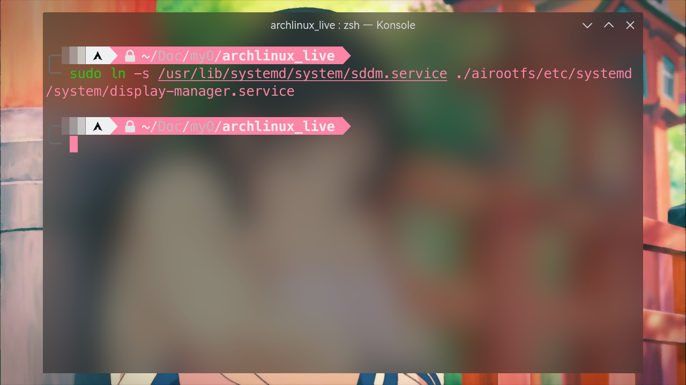

   2. 为了让图形环境在启动过程中自动启动，创建并编辑 `airootfs/root/customize_airootfs.sh`：

      ```bash
      sudo vim /path/of/some_folder/archlinux_live/airootfs/root/customize_airootfs.sh
      ```

      添加以下内容：

      ```bash
      systemctl set-default graphical.target
      ```

      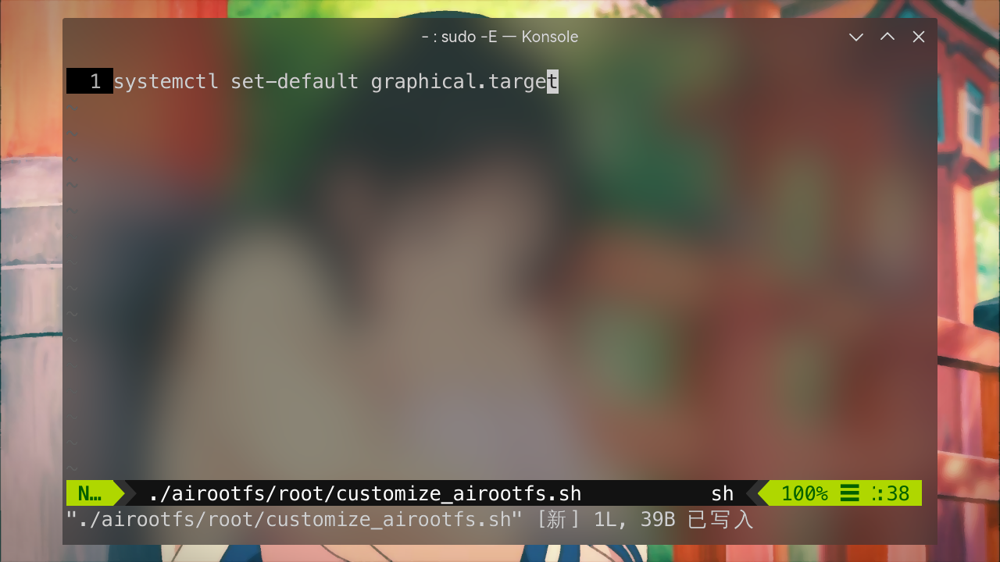

### 3. 开始制作

1. 创建工作目录和输出目录：

   ```bash
   sudo mkdir -p /mnt/work /mnt/out
   ```

   

2. 开始制作镜像文件：

   ```bash
   sudo mkarchiso -v -w /mnt/work -o /mnt/out /path/to/profile/
   ```

   

3. 根据前述方法 [Ventoy（推荐）](./make-install-disk.md#ventoy-推荐)、[balenaEtcher](./make-install-disk.md#balenaetcher) 或 [dd 命令](./advanced/make-install-disk.md#dd-命令) 将镜像制作为 archlinux 内存系统盘即可

> 📔 本节参考资料：
>
> - [制作 Arch Linux 内存系统启动盘](https://blog.phoenixlzx.com/2018/12/14/bootable-archlinux-in-memory-rescue-system/)（知识共享署名-相同方式共享 4.0 国际许可协议）
