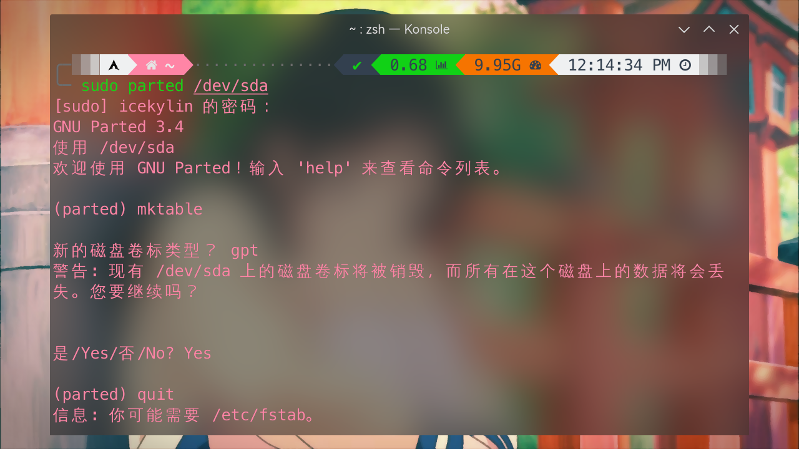
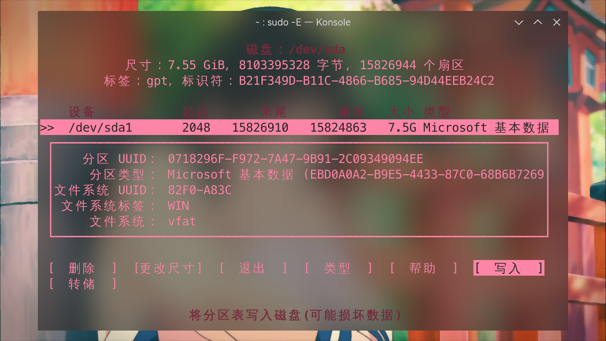
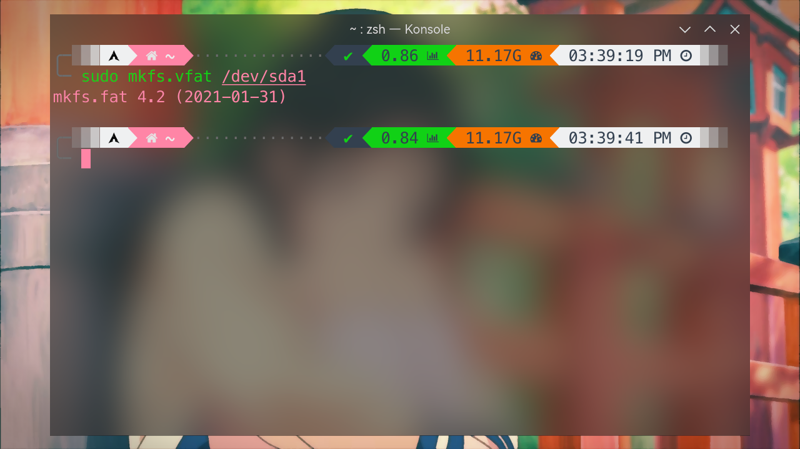
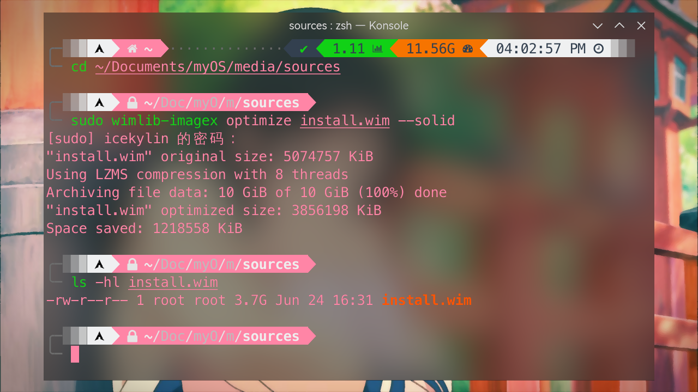
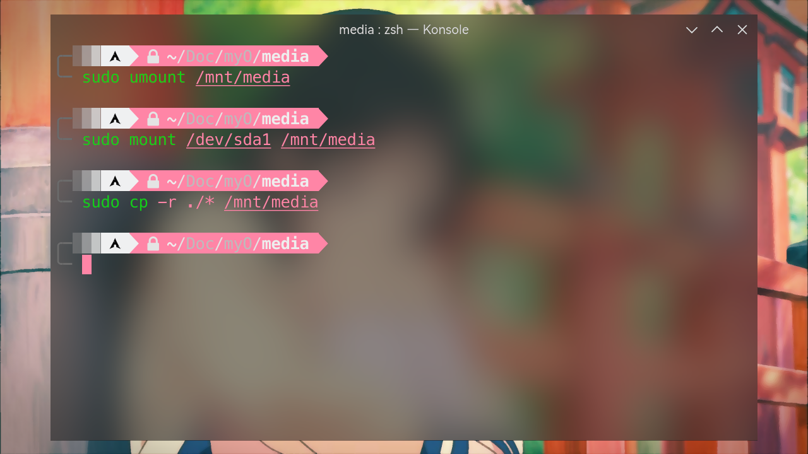

# 制作系统盘

> ### 🥀 落红不是无情物，化作春泥更护花
>
> 本节介绍在 archlinux 下如何制作系统安装盘（启动盘）

> ### 🔖 这一节将会讨论：
>
> [[toc]]

## 通用方法

### ventoy

### balenaEtcher

## 手动制作

### dd 命令

### win10 / win11 安装盘

以往在 Linux 下手动制作一个 win10 / win11 安装盘还是很简单的，但是随着近几年微软的更新，其 iso 安装镜像中存在一个名为`install.wim`的文件，其大小已经超出了 4GB（fat32 要求的单个文件最大 4GB）的限制。这使得必须用额外的步骤才能制作一个启动盘。

这里依旧使用 fat32 格式是因为其兼容性是最好的，NTFS 的 UEFI 安装盘很多情况下不被识别。

1. 首先用 `parted` 命令创建 U 盘的分区。`label type` 输入 `gpt`：

   ```bash
   sudo parted /dev/sdx # 执行 parted，进行磁盘类型变更
   (parted) mktable # 输入 mktable
   新的磁盘卷标类型？ gpt # 输入 gpt，将磁盘类型转换为 GPT 类型。如磁盘有数据会警告，输入 Yes 即可
   (parted) quit # 退出 parted 命令行交互
   ```

   

   ::: danger ☢️ 警告

   重建分区表会使 U 盘所有数据丢失，请事先确认。

   :::

   ::: tip ℹ️ 提示

   也可以使用图形化的分区工具如 [KDE 分区管理器](https://apps.kde.org/partitionmanager/)。

   :::

2. 接下来类似 [7-1. 分区](../rookie/basic-install.md#_7-1-分区)，用 `cfdisk` 命令创建新分区。在 `Type` 中选择 `Microsoft 基本数据`：

   ```bash
   sudo cfdisk /dev/sdx
   ```

   

3. 接下来使用 `mkfs.vfat` 命令格式化所创建的分区，这样 U 盘就准备好了：

   ```bash
   sudo mkfs.vfat /dev/sdxn
   ```

   

4. 接下来下载 win10 / win11 的 iso 镜像并解压。由于 Ark 尚不支持 UDF 文件系统的 ISO 文件，我们需要手动挂载并将其中的内容复制出来：

   

   ```bash
   sudo mount -o loop /path/of/windows_iso_name.iso /mnt/mount_point
   cp -a /mnt/mount_point /path/of/some_folder
   ```

   

5. 得到复制出来的文件后，最后要进行的就是压缩 `install.wim` 文件（在 `sources` 文件夹下）。这里需要首先安装一个包 `wimlib`（可能已经作为依赖安装了）：

   ```bash
   sudo pacman -S wimlib
   ```

6. 接下来进行压缩。这一步会持续较长时间，耐心等待。完成后可以看到文件已经被压缩到了 3.x GB：

   ```bash
   cd /path/of/some_folder/sources
   sudo wimlib-imagex optimize install.wim --solid
   ls -hl install.wim
   ```

   

7. 最后把全部文件复制到 U 盘中即可：

   ```bash
   sudo umount /mnt/mount_point # 卸载掉镜像
   sudo mount /dev/sdxn /mnt/mount_point # 挂载 U 盘
   sudo cp -r /path/of/some_folder/* /mnt/media # 复制全部文件
   ```

   

8. 复查一下并卸载 U 盘：

   ```bash
   ls -hl /mnt/mount_point # 复查一下
   sudo umount /mnt/mount_point # 卸载 U 盘
   ```

   

自此，一个 win10 / win11 安装盘便制作完成了。
