# 其它可选配置（进阶篇）

> ### 🎑 一分耕耘，一分收获
>
> 这一节的配置都是可选的。这些配置根据个人喜好进行配置，往往可以让系统变得更好用

> ### 🔖 这一节将会讨论：
>
> ::: details 目录
>
> [[toc]]
>
> :::

## 🐧 更换可选内核

如有需要可参阅 [archWiki 相关内容](<https://wiki.archlinux.org/title/Kernel_(%E7%AE%80%E4%BD%93%E4%B8%AD%E6%96%87)>) 以及 [rEFind 官方文档](http://www.rodsbooks.com/refind/linux.html)。

除了 [linux](https://archlinux.org/packages/core/x86_64/linux/) 内核，还有以下官方支持的内核可供选择：

- [linux-zen](https://archlinux.org/packages/extra/x86_64/linux-zen/)
  - 一些内核黑客合作的结果，是适合日常使用的优秀内核
  - 以吞吐量和功耗为代价来换取性能
  - 相对 linux 内核加入了 fsync 功能，在一些采用 .Net 的 wine 游戏中会有 [明显的性能提升](https://github.com/ValveSoftware/Proton/issues/3706#issuecomment-636632984)
- [linux-lts](https://archlinux.org/packages/core/x86_64/linux-lts/)
  - 包含了最新的长期支持的 Linux 内核和内核模块
  - 可以放心地在更长的时间内享受相同的内核版本
  - 若硬件不是最新硬件，则可以通过安装稍早的 LTS 内核提高稳定性
- [linux-hardened](https://archlinux.org/packages/extra/x86_64/linux-hardened/)
  - 更加注重安全的内核，采用一系列 [加固补丁](https://github.com/GrapheneOS/linux-hardened) 以减少内核和用户空间产生漏洞的风险
  - 启用了一些加固选项，比如用户命名空间（同时通过补丁禁用未授权用户的访问）、审计以及 SELinux
  - 需要注意的是使用此内核时部分软件包将不起作用

:::: code-group
::: code-group-item zen

```bash
sudo pacman -S linux-zen linux-zen-headers
```

:::
::: code-group-item lts

```bash
sudo pacman -S linux-lts linux-lts-headers
```

:::
::: code-group-item hardened

```bash
sudo pacman -S linux-hardened linux-hardened-headers
```

:::
::::

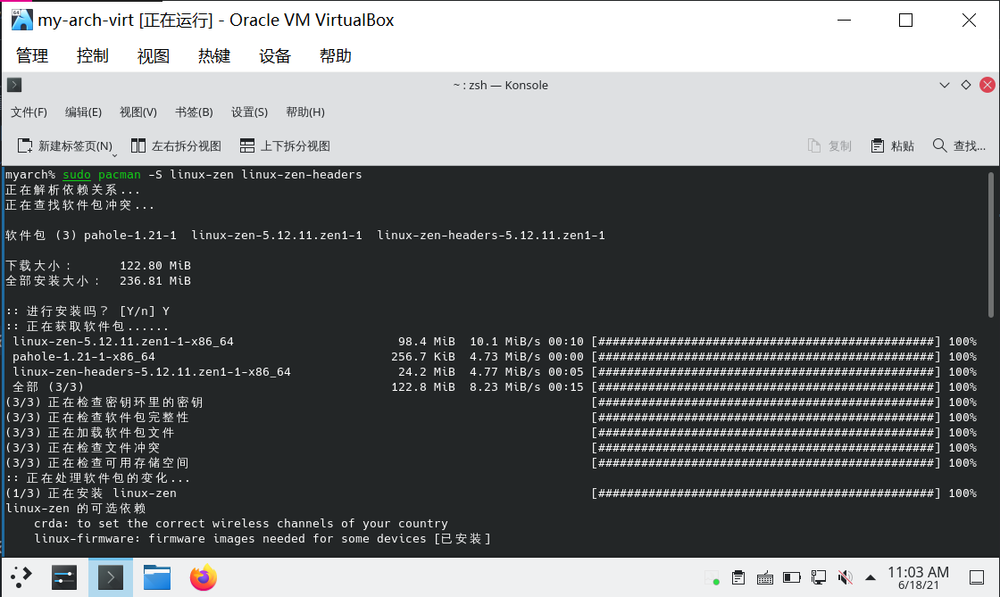

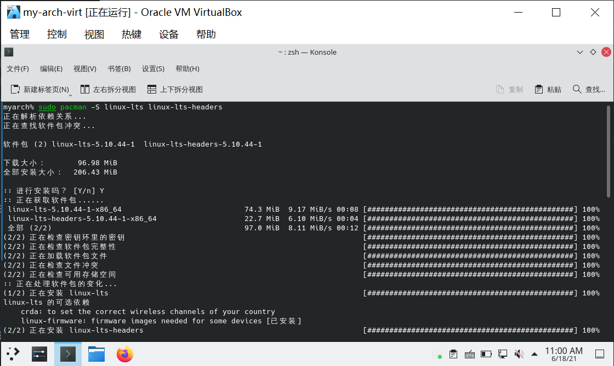

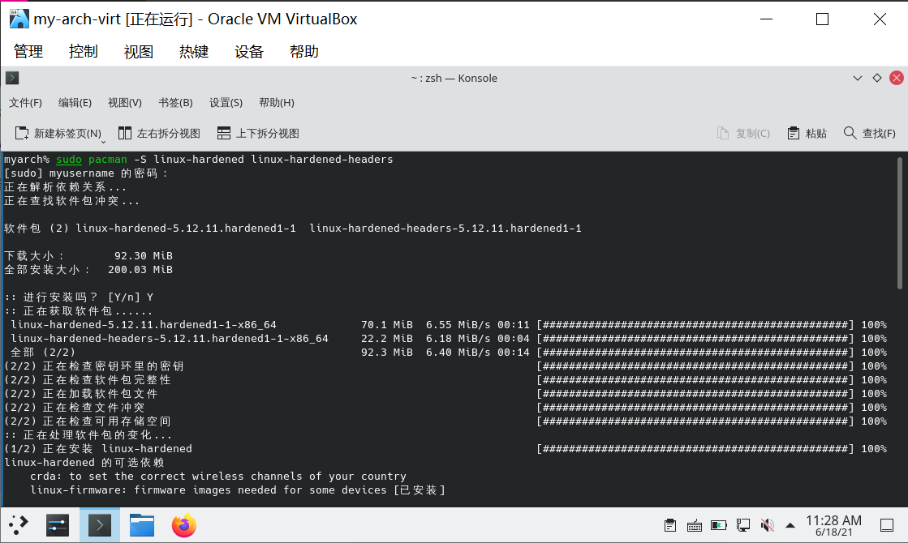

::: tip ℹ️ 提示

更换内核后还需要留意部分应用需要更换为相应的 dkms 版本。

本指南涉及的应用如下：

- [`nvidia-dkms`](./graphic-driver.md#nvidia-独立显卡)
- [`bbswitch-dkms`](./graphic-driver.md#电源管理)

:::

> #### 📑 相关资料：DKMS
>
> DKMS，即 **D**ynamic **K**ernel **M**odule **S**ystem。可以使内核变更（如升级）后自动编译模块，适配新内核。

2. 为了让 GRUB 记住最后在 GRUB 引导菜单里选择的内核，以便在下次启动时自动使用对应的内核，需要编辑 `/etc/default/grub` 文件：

```bash
sudo vim /etc/default/grub
```

在适当位置添加或修改为如下三行：

```bash
GRUB_DEFAULT=saved # 默认使用保存的内核条目
GRUB_SAVEDEFAULT=true # 保存最后一个使用的内核条目
GRUB_DISABLE_SUBMENU=y # 可选，禁用 GRUB 子菜单，使选择内核的操作更简单
```

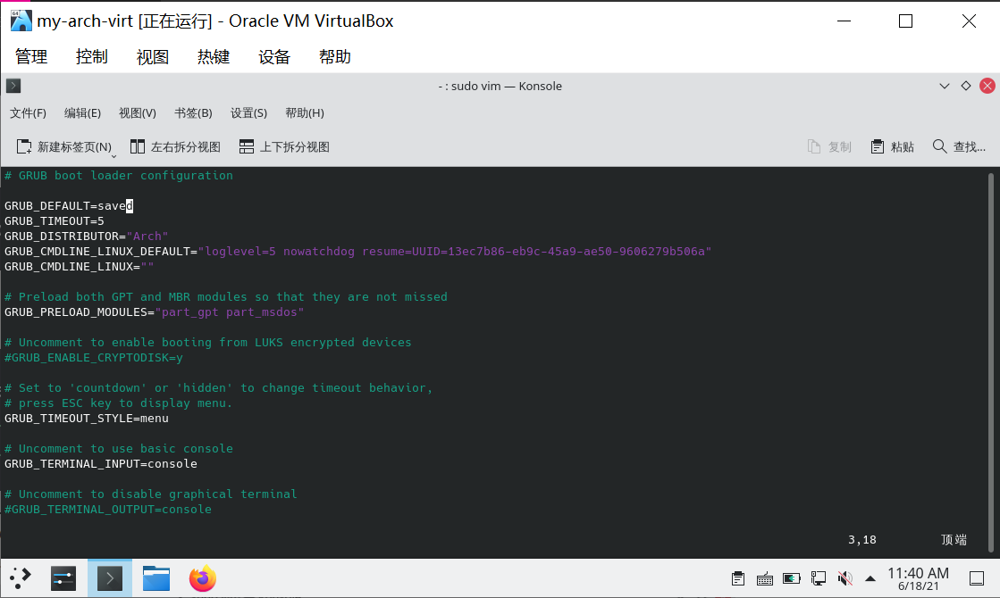

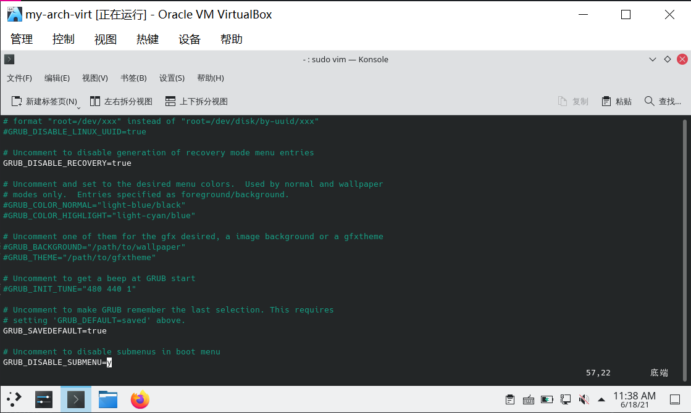

3. 安装完毕后通过以下命令更新一下引导配置即可：

```bash
sudo grub-mkconfig -o /boot/grub/grub.cfg
```

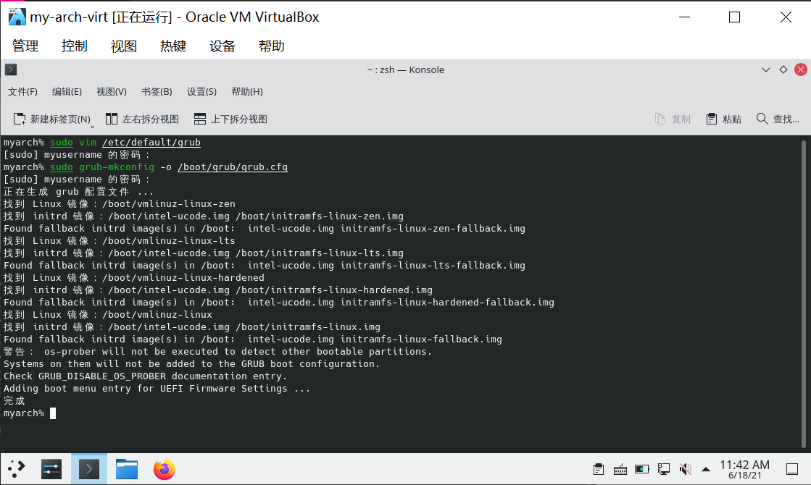

4. rEFind 不需要做额外步骤，但会使用安装的最后一个内核作为默认内核。若想改变默认启动内核，需要修改 rEFind 配置文件：

```bash
sudo vim /boot/efi/EFI/refind/refind.conf
```

::: tip ℹ️ 提示

若您不是按照本指南章节 [archlinux 基础安装](./basic-install.md) 安装的 archlinux，请确认您的 EFI 分区（ESP）位置。

:::

将 `fold_linux_kernels false` 前面的注释（`#`）去掉：

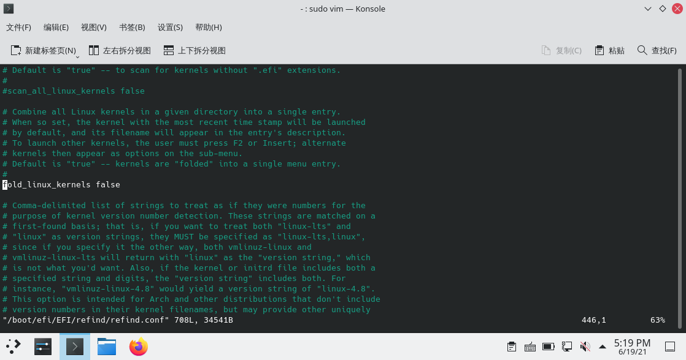

诚然，这不是一个优雅（elegant）的方案。它会将所有的内核直接在引导菜单首页显示出来，而不是在子菜单选择。但 [唯有这样](https://bbs.archlinux.org/viewtopic.php?id=258751) rEFind 才能记住最后选择的内核，而不是安装的最后一个内核。

5. 重启，查看引导菜单效果：

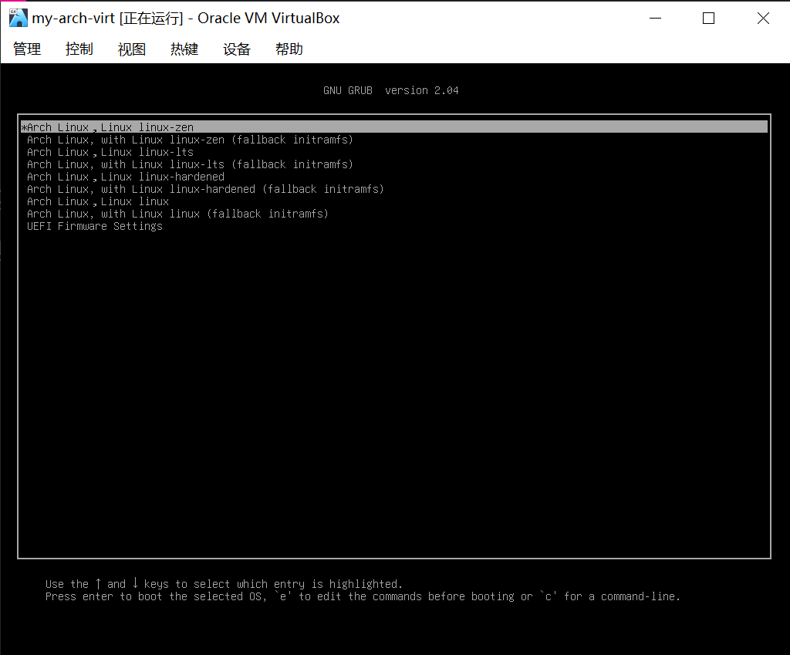


6. 使用以下命令查看内核：

:::: code-group
::: code-group-item uname

```bash
uname -r
```

:::
::: code-group-item neofetch

```bash
neofetch
```

:::
::::

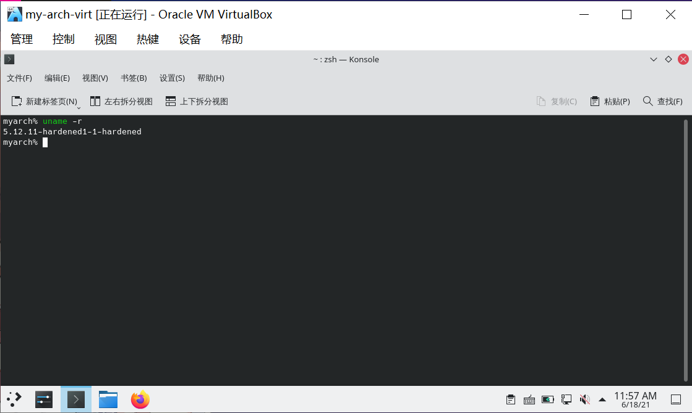

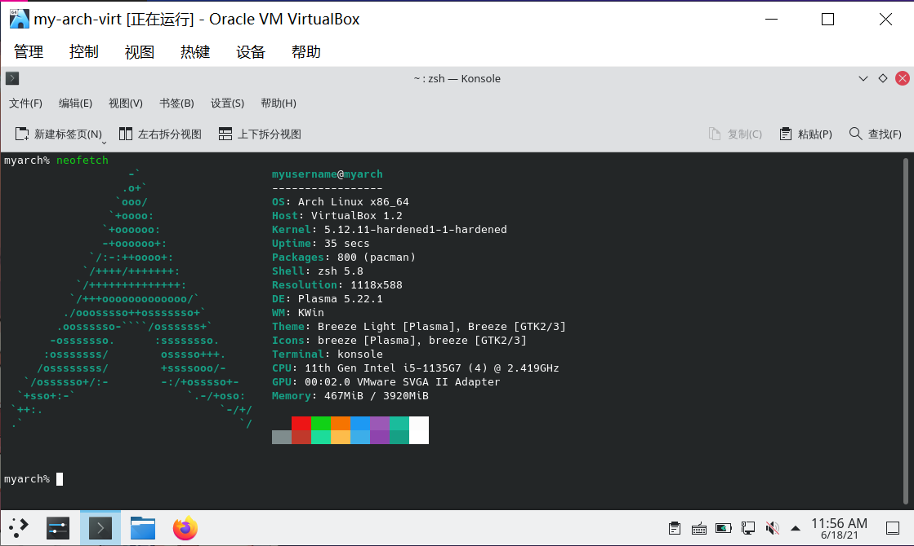

## 💤 休眠（hibernate）设置

如有需要可以参阅 [archWiki 相关内容](<https://wiki.archlinux.org/title/Power_management_(%E7%AE%80%E4%BD%93%E4%B8%AD%E6%96%87)/Suspend_and_hibernate_(%E7%AE%80%E4%BD%93%E4%B8%AD%E6%96%87)>)。

KDE 自身提供开箱即用的睡眠功能（sleep），即将系统挂起到内存，消耗少量的电量。休眠（hibernate）则会将系统挂起到交换分区或交换文件，几乎不消耗电量。

挂起到硬盘的映像大小一般最大为物理内存的 `2/5`，其值在 `/sys/power/image_size` 中确定。故若想使用休眠功能，Swap 大小一般设置为物理内存的 60% 即可。

::: tip ℹ️ 提示

若 Swap 分区大小不够，则可尝试创建并休眠到 Swap 文件中。

但是需要注意！休眠镜像不能跨多个交换分区和 / 或交换文件。它必须完全适配**一个交换分区或一个交换文件**。

:::

### 休眠到 Swap 分区

1. 通过以下命令确认 Swap 分区的 `UUID`：

:::: code-group
::: code-group-item lsblk

```bash {8}
lsblk -o name,mountpoint,size,uuid
```

:::
::: code-group-item blkid

```bash
sudo blkid
```

:::
::::

输出结果应类似：

:::: code-group
::: code-group-item lsblk

```bash {6}
NAME   MOUNTPOINT              SIZE UUID
sda                             64G
├─sda1 /boot/efi               244M E519-88D8
├─sda2                           1G
├─sda3                           1G
├─sda4 [SWAP]                    4G 13ec7b86-eb9c-45a9-ae50-9606279b506a
└─sda5 /run/timeshift/backup  57.8G 860b9d91-590c-44d0-9d38-e4bf137b5d90
sr0                          755.3M 2021-05-01-05-18-20-00
```

:::
::: code-group-item blkid

```bash {2}
/dev/sr0: BLOCK_SIZE="2048" UUID="2021-05-01-05-18-20-00" LABEL="ARCH_202105" TYPE="iso9660" PTTYPE="PMBR"
/dev/sda4: UUID="13ec7b86-eb9c-45a9-ae50-9606279b506a" TYPE="swap" PARTUUID="7a9e75d7-eca2-c849-9372-85c6889a7861"
/dev/sda2: PARTUUID="bfc5f742-be1e-cb41-911f-ec5466d670de"
/dev/sda5: LABEL="myArch" UUID="860b9d91-590c-44d0-9d38-e4bf137b5d90" UUID_SUB="5551b2c6-b767-4459-b7fc-de91500baec0" BLOCK_SIZE="4096" TYPE="btrfs" PARTUUID="815c3576-3bb8-dc4e-86d4-f41c45cffd42"
/dev/sda3: PARTUUID="23bddb1f-4ef9-844c-a92a-805a4063e3c1"
/dev/sda1: SEC_TYPE="msdos" UUID="E519-88D8" BLOCK_SIZE="512" TYPE="vfat" PARTUUID="1976beb2-c881-8046-9066-21d5dac457ce"
```

:::
::::

> #### 📑 相关资料：UUID
>
> UUID 即 **U**niversally **U**nique **Id**entifier（通用唯一识别码），它可以帮助 Linux 系统识别一个磁盘分区而不是块设备文件。

2. 使用 `vim` 编辑 `/etc/default/grub` 文件：

```bash
sudo vim /etc/default/grub
```

将相关参数加入内核启动参数中 —— 找到 `GRUB_CMDLINE_LINUX_DEFAULT` 一行，在其值后添加类似如下数据（根据你自身的 UUID 确定，参数之间以空格分隔）：

```conf
resume=UUID=13ec7b86-eb9c-45a9-ae50-9606279b506a
```

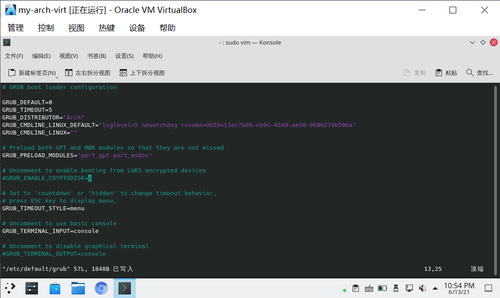

> #### 🍧 碎碎念
>
> 这个内核启动参数在步骤 [17. 安装引导程序](./basic-install.md#_17-安装引导程序) 中也修改过，现在应该稍微熟悉一点了吧？

3. 接下来参考步骤 [共同后续步骤](./optional-cfg.md#共同后续步骤) 完成配置。

### 休眠到 Swap 文件（Btrfs）

### 休眠到 Swap 文件（ext4）

1. 首先确认 Swap 文件所在分区的 `UUID`：

```bash
sudo findmnt -no UUID -T /swapfile
```

2. 确认 Swap 文件的偏移值：

```bash
sudo filefrag -v /swapfile
```

第一行数据中的 `physical_offset` 一列的值即为所需要的数据。

3. 随后将这两个参数加入内核启动参数中。通过 `vim` 编辑 `/etc/default/grub` 文件：

```bash
sudo vim /etc/default/grub
```

找到 `GRUB_CMDLINE_LINUX_DEFAULT` 一行，在其值后添加类似如下两项数据，内容根据刚才查询的 `UUID` 以及偏移值确定。参数以空格分隔：

```conf
resume=UUID=9a940a0a-fa72-4973-9ccc-3eb93ad73b37 resume_offset=6418432
```

4. 接下来参考步骤 [共同后续步骤](./optional-cfg.md#共同后续步骤) 完成配置。

### 共同后续步骤

1. 通过以下命令更新 GRUB 配置：

```bash
sudo grub-mkconfig -o /boot/grub/grub.cfg
```

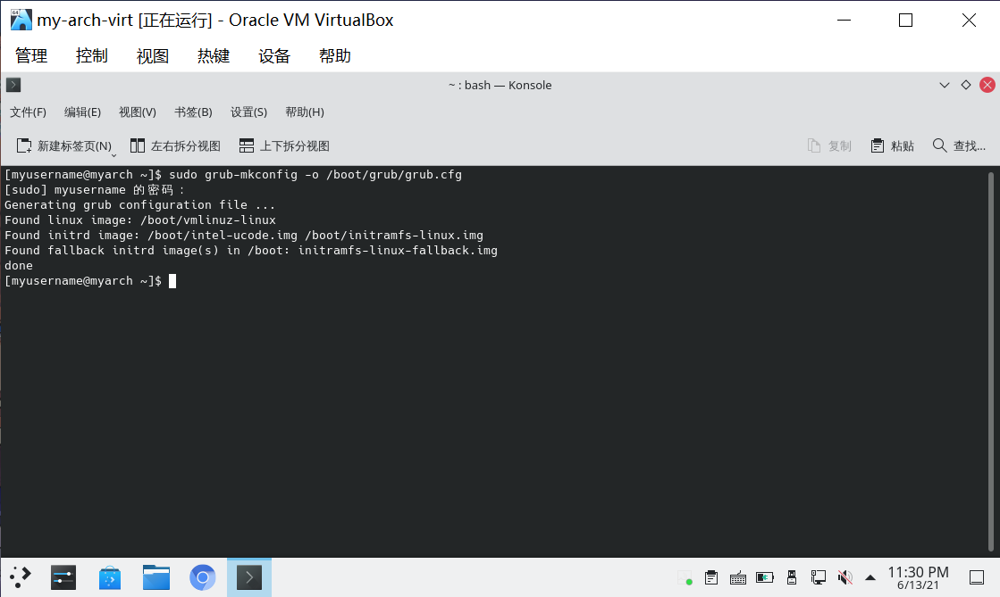

2. 除此之外，还需配置 `initranfs` 的 `resume` 钩子。使用 `vim` 编辑 `/etc/mkinitcpio.conf`：

```bash
sudo vim /etc/mkinitcpio.conf
```

在 HOOKS 行添加 `resume` 值。注意，`resume` 需要加入在 `udev` 后。若使用了 LVM 分区，`resume` 需要加入在 `lvm2` 后：

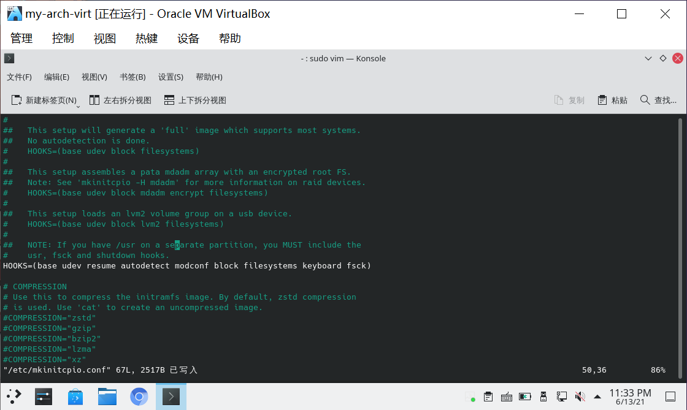

::: tip ℹ️ 提示

使用 Intel CPU 并且为触摸板加载 `intel_lpss_pci` 模块的笔记本电脑，可能会在唤醒时发生内核崩溃（Caps Lock 灯闪烁），黑屏并无法成功唤醒。

此时需要编辑 `/etc/mkinitcpio.conf`，在 MODULES 行添加 `intel_lpss_pci` 值：

```conf
MODULES=(intel_lpss_pci)
```

:::

3. 最后通过以下命令重新生成 `initramfs` 镜像：

```bash
sudo mkinitcpio -P
```


4. 重启电脑

5. 重启之后可以开几个应用，尝试休眠：


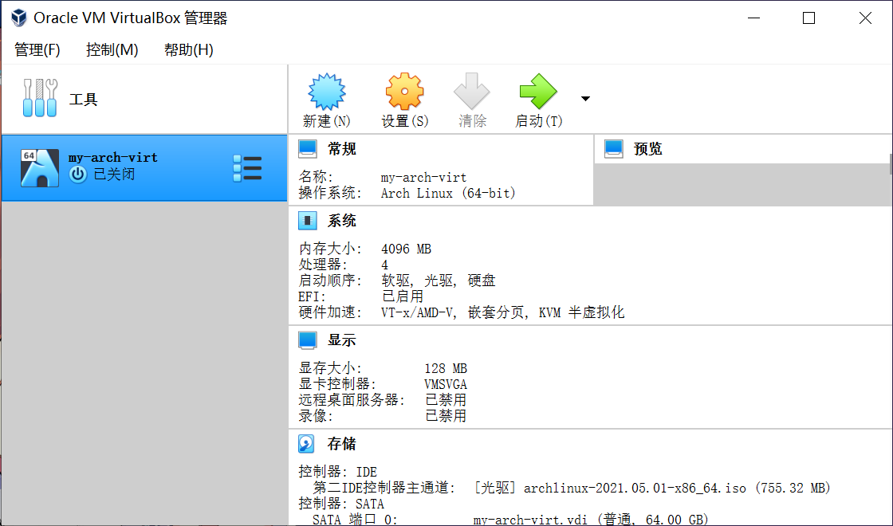


虚拟机也可以通过休眠成功唤醒。

::: tip ℹ️ 提示

虚拟机可能在休眠唤醒后的关机时发生内核崩溃（Caps Lock 灯也会闪烁）。

:::

## 🔍 rEFind

如有需要可以参考 [archWiki 相关内容](<https://wiki.archlinux.org/title/REFInd_(%E7%AE%80%E4%BD%93%E4%B8%AD%E6%96%87)>)。

相对于 GRUB，rEFind 的启动项更加灵活，相对来说也更加美观。

1. 使用以下命令安装 `refind` 包：

```bash
sudo pacman -S refind
```

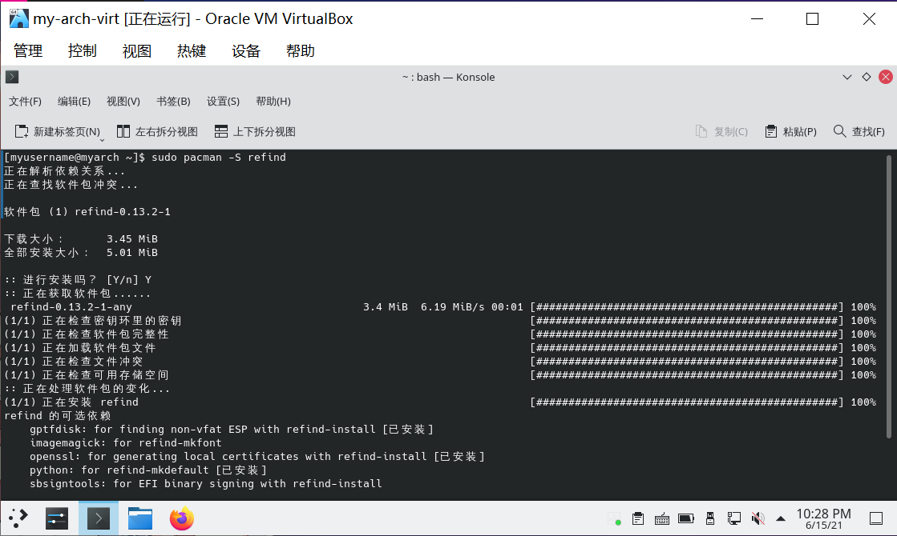

2. 使用以下命令安装 rEFInd 启动管理器到 EFI 分区：

```bash
sudo refind-install
```


3. 使用以下命令复查安装情况：

```bash
ls -ahl /boot/efi/EFI/
```

::: tip ℹ️ 提示

若您不是按照本指南章节 [archlinux 基础安装](./basic-install.md) 安装的 archlinux，请确认您的 EFI 分区（ESP）位置。

:::


输出结果应该可以看到 `refind` 文件夹。

4. 使用 `vim` 编辑 `/boot/efi/EFI/refind/refind.conf` 文件：

```bash
sudo vim /boot/efi/EFI/refind/refind.conf
```

修改等待时间为合适数值（自定义）：

```bash
timeout 5
```


为了使 rEFInd 支持 archlinux 内核命名方案并使其与各自的 initramfs 镜像相匹配，取消注释并编辑 `extra_kernel_version_strings` 所在行：

```bash
extra_kernel_version_strings linux-hardened,linux-zen,linux-lts,linux
```


为了允许在 Btrfs 子卷上进行内核自动检测，取消注释并编辑 `also_scan_dirs`，在最后加上 `@/boot`：

```bash
also_scan_dirs boot,ESP2:EFI/linux/kernels,@/boot
```

::: tip ℹ️ 提示

若您不是按照本指南章节 [archlinux 基础安装](./basic-install.md) 安装的 archlinux：

- 若使用了 ext4 文件系统，则不用修改这一行。
- 若使用了 Btrfs 文件系统，请确认根目录或 `/boot` 目录对应子卷位置（简而言之这个位置是从 Btrfs 文件系统最上层开始寻找的）

:::

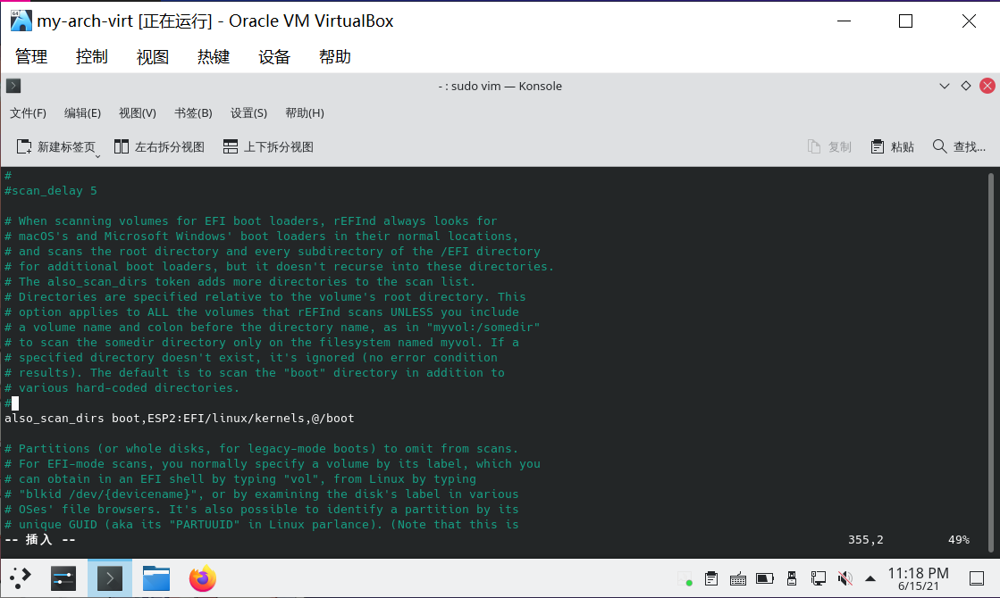

5. 保存并退出 `vim`

6. 若安装 archlinux 时按照步骤 [7. 分区和格式化（使用 Btrfs 文件系统）](./basic-install.md#_7-分区和格式化-使用-btrfs-文件系统) 使用了 Btrfs 文件系统，为了让 rEFind 支持 Btrfs 子卷，需要使用以下命令手动为 rEFind 安装驱动：

```bash
sudo cp /usr/share/refind/drivers_x64/btrfs_x64.efi /boot/efi/EFI/refind/drivers_x64/btrfs_x64.efi
```

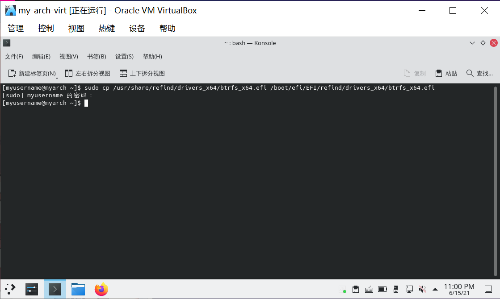

7. 使用以下命令复查安装情况：

```bash
ls -ahl /boot/efi/EFI/refind/drivers_x64/
```

输出如下：

```bash
-rwxr-xr-x 1 root root 114K Jun 15 23:00 /boot/efi/EFI/refind/drivers_x64/btrfs_x64.efi
```

8. 使用以下命令在内核所在文件夹（`/boot`）创建包含内核参数的 `refind_linux.conf` 文件：

```bash
sudo mkrlconf --force
```

::: tip ℹ️ 提示

对于自动检测到的内核，可以在 `/boot/refind_linux.conf` 中显式指定内核参数，也可以依靠 rEFInd 识别根分区和内核参数的能力。此处便是使用了后者。

若要修改内核参数，可以用 GRUB 使用新内核参数登录系统后重新使用此步骤命令重新生成 `/boot/refind_linux.conf` 文件，也可以直接在 `/boot/refind_linux.conf` 显式指定内核参数。

:::

9. 加载微码的内核参数不会自动创建。为了加载微码，需要手动编辑 `/boot/refind_linux.conf`：

```bash
sudo vim /boot/refind_linux.conf
```

在内核参数中加入以下内容：

```conf
initrd=@\boot\intel-ucode.img initrd=@\boot\initramfs-%v.img # Intel
initrd=@\boot\amd-ucode.img initrd=@\boot\initramfs-%v.img # AMD
```

::: tip ℹ️ 提示

若您不是按照本指南章节 [archlinux 基础安装](./basic-install.md) 安装的 archlinux，请确认您的微码位置。

此外，参数 `initrd` 中使用反斜杠（`\`）而不是斜杠（`/`）作为路径分隔符。

:::

10. 复查 `/boot/refind_linux.conf` 文件：

```bash
cat /boot/refind_linux.conf
```

输出如下：

```bash
"Boot with standard options"  "root=UUID=860b9d91-590c-44d0-9d38-e4bf137b5d90 rw rootflags=subvol=@ loglevel=5 nowatchdog resume=UUID=13ec7b86-eb9c-45a9-ae50-9606279b506a initrd=@\boot\intel-ucode.img initrd=@\boot\initramfs-%v.img"
"Boot to single-user mode"    "root=UUID=860b9d91-590c-44d0-9d38-e4bf137b5d90 rw rootflags=subvol=@ loglevel=5 nowatchdog resume=UUID=13ec7b86-eb9c-45a9-ae50-9606279b506a initrd=@\boot\intel-ucode.img initrd=@\boot\initramfs-%v.img single"
"Boot with minimal options"   "ro root=UUID=860b9d91-590c-44d0-9d38-e4bf137b5d90"
```

::: tip ℹ️ 提示

若需要配置默认引导内核，请参阅步骤 [🐧 更换可选内核](./optional-cfg-2.md#🐧-更换可选内核)。

:::

11. 重启电脑，便可以看到 rEFind 的引导页面了：

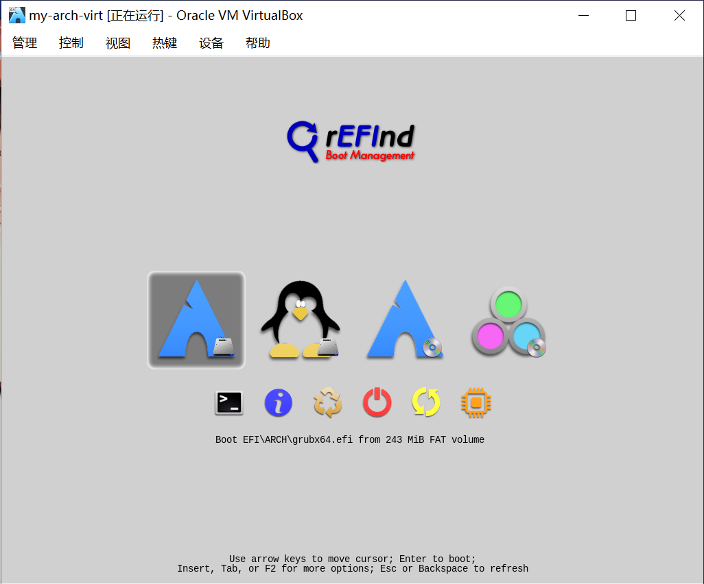

这个选项是通过 GRUB 套娃启动系统。


这个选项是通过 rEFind 直接引导进入系统。

::: tip ℹ️ 提示

在对应系统的位置按下 `F2` 可进入子菜单：

:::

::: tip ℹ️ 提示

若引导了 win10 也会显示出来。

:::

::: tip ℹ️ 提示

后面两位是虚拟机安装 archlinux 后留下来的安装镜像（实体机没有），不想要可以请使用以下步骤移除

1. 关闭虚拟机后打开虚拟机设置 > 侧栏 `存储` > 点击右侧 `分配光驱` 的右侧光盘小图标：

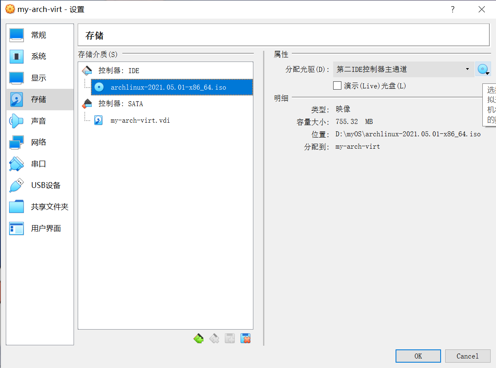

2. 点击 `移除虚拟盘`：


3. 开启虚拟机，查看效果：


:::

关于 rEFind 的美化请参阅 [系统美化]()。
