# 视频制作

> ### 💃🏻 商女不知亡国恨，隔江犹唱后庭花
>
> 本小节讨论如何在 archlinux 上制作视频以及直播推流。

> ### 🔖 这一节将会讨论：
>
> ::: details 目录
>
> [[toc]]
>
> :::

::: tip ℹ️ 提示

指南中带有 <sup>aur</sup> 角标的软件代表是在 [AUR](https://aur.archlinux.org/)（Arch User Repository）中用户自行打包的软件。不在 arch 官方支持范围内，可能会出现各种问题如更新不及时、无法安装、使用出错等。

指南中带有 <sup>cn</sup> 角标的软件代表是在 [archlinuxcn](https://www.archlinuxcn.org/archlinux-cn-repo-and-mirror/)（Arch Linux 中文社区仓库）中用户自行打包的软件。不在 arch 官方支持范围内，可能会出现各种问题如更新不及时、无法安装、使用出错等。

指南中带有 <sup>EULA</sup> 角标的软件代表是 [专有软件](https://www.gnu.org/proprietary/proprietary.html)。请自行斟酌是否使用。

:::

## 🎬 制作软件

### Kdenlive

[Kdenlive](https://kdenlive.org/zh/) 是由 KDE 开发的自由开源的免费视频编辑软件。

安装 [Kdenlive](https://archlinux.org/packages/extra/x86_64/kdenlive/)<sup>extra / aur</sup>：

:::: code-group
::: code-group-item extra

```sh
sudo pacman -S kdenlive
```

:::
::: code-group-item aur (git)

```sh
yay -S kdenlive-git
```

:::
::::


### Shotcut

[Shotcut](https://www.shotcut.org/) 是一个免费开源的跨平台视频编辑软件。

安装 [Shotcut](https://archlinux.org/packages/community/x86_64/shotcut/)<sup>community / aur</sup>：

:::: code-group
::: code-group-item community

```sh
sudo pacman -S shotcut
```

:::
::: code-group-item aur (git)

```sh
yay -S shotcut-git
```

:::
::::

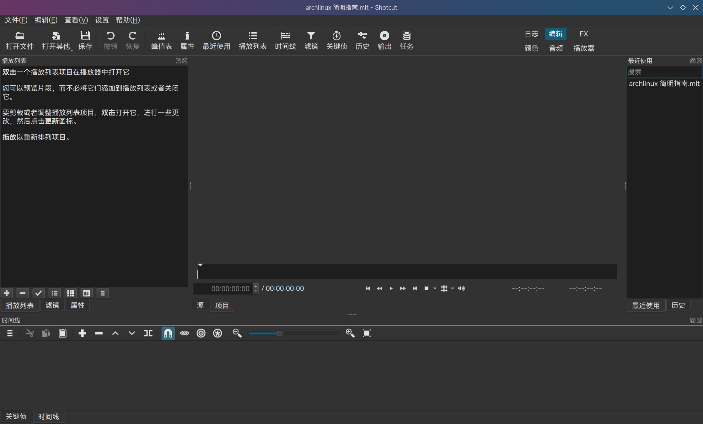

### MKVToolNix

[MKVToolNix](https://mkvtoolnix.download/index.html) 是一套功能强大的 \*.mkv 格式制作和处理的工具。支持将多种视频、音频、字幕等格式封装成 \*.mkv 格式。

安装 [MKVToolNix](https://archlinux.org/packages/extra/x86_64/mkvtoolnix-gui/)<sup>extra / aur</sup>：

:::: code-group
::: code-group-item extra

```sh
sudo pacman -S mkvtoolnix-gui
```

:::
::: code-group-item aur (git)

```sh
yay -S mkvtoolnix-git
```

:::
::::

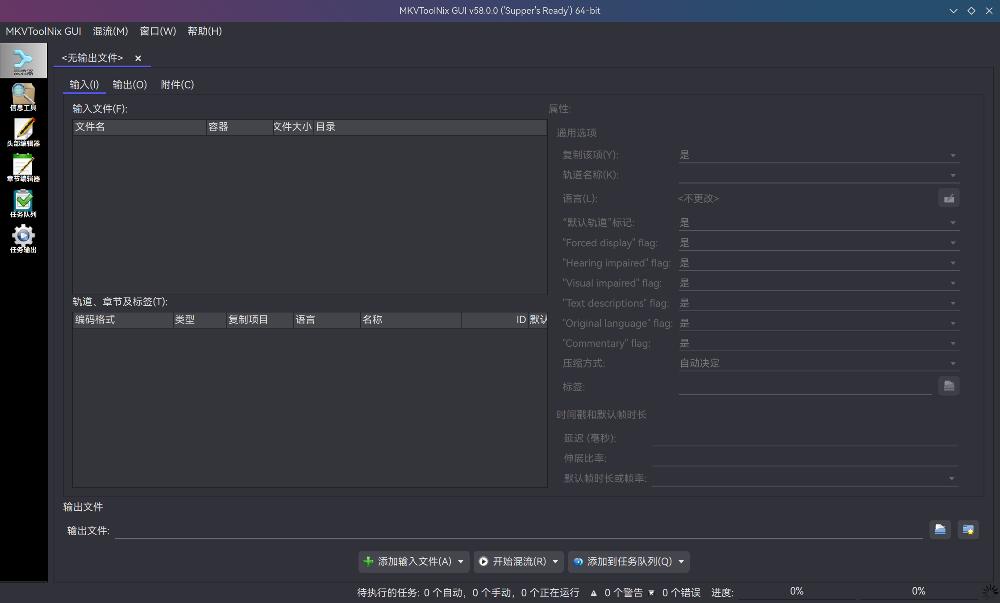

::: tip ℹ️ 提示

可在菜单栏 `MKVToolNix GUI` > `Preferences` > 侧边栏 `GUI` > `Interface language` 中将语言更改为 `简体中文`：

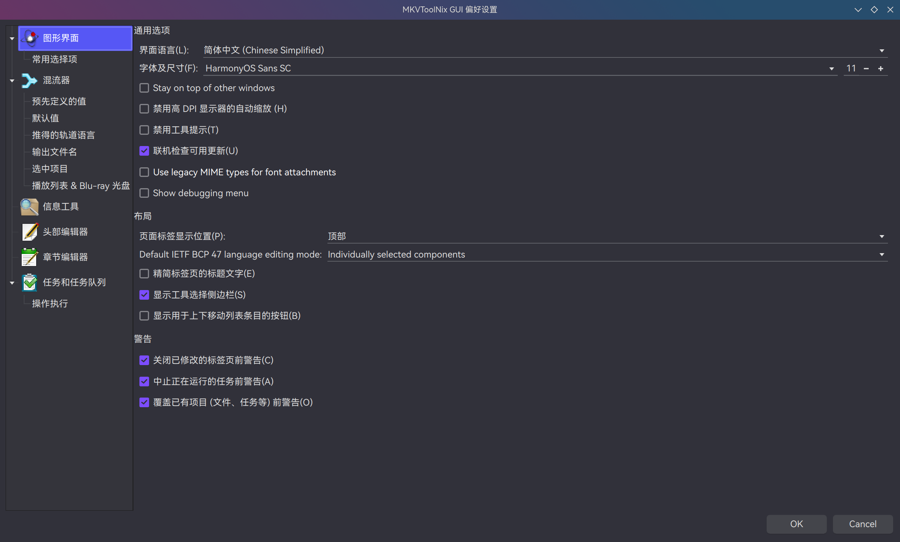

:::

### DaVinci Resolve

[DaVinci Resolve](http://www.blackmagicdesign.com/cn/products/davinciresolve/) 是一款将剪辑、调色、视觉特效、动态图形和音频后期制作融于一身的视频编辑软件。

安装 [DaVinci Resolve（免费版）](https://aur.archlinux.org/packages/davinci-resolve/)<sup>EULA / aur</sup>：

:::: code-group
::: code-group-item aur

```sh
yay -S davinci-resolve
```

:::
::: code-group-item aur (beta)

```sh
yay -S davinci-resolve-beta
```

:::
::::

::: tip ℹ️ 提示

DaVinci Resolve（免费版）在 Linux 下支持的编解码格式有限，详情请参阅此 [📄 文档](https://documents.blackmagicdesign.com/SupportNotes/DaVinci_Resolve_15_Supported_Codec_List.pdf)。

DaVinci Resolve 没有编入 fcitx 模块，所以在 Linux 下不能输入中文，可以使用剪贴板解决。  

:::

另外还有 [DaVinci Resolve Studio（付费版）](https://aur.archlinux.org/packages/davinci-resolve-studio/)<sup>EULA / aur</sup>：

:::: code-group
::: code-group-item aur

```sh
yay -S davinci-resolve-studio
```

:::
::: code-group-item aur (beta)

```sh
yay -S davinci-resolve-studio-beta
```

:::
::::

## 📡 录屏直播

### OBS Studio

[OBS Studio](https://obsproject.com/zh-cn) 是免费开源的用于视频录制以及直播串流的软件。Linux 下操作与 Windows 下基本一致。

安装 [OBS Studio](https://www.archlinux.org/packages/community/x86_64/obs-studio/)<sup>community / aur</sup>：

:::: code-group
::: code-group-item aur (browser)

```sh
yay -S obs-studio-browser # 有浏览器插件集成的 OBS Studio。编译要很久（大约 15 min）
```

:::
::: code-group-item community

```sh
sudo pacman -S obs-studio
```

:::
::: code-group-item aur (git)

```sh
yay -S obs-studio-git
```

:::
::::

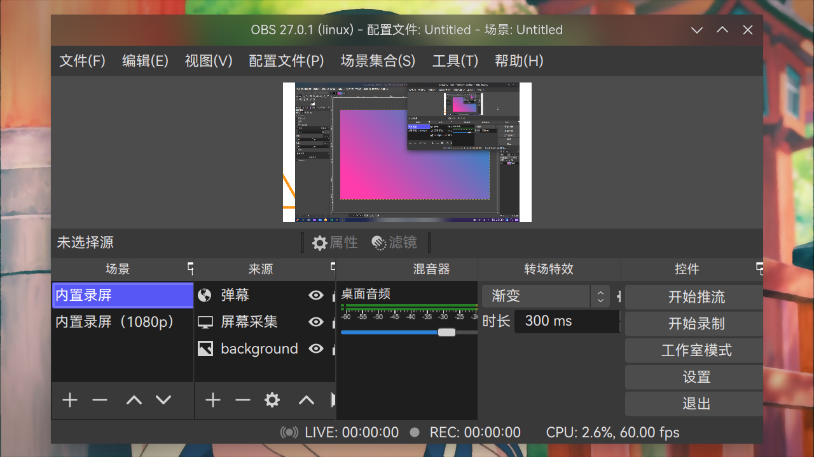

::: tip ℹ️ 提示

如果你使用较新的 NVIDIA 显卡，可以使用 NVENC 编码器。这将大大降低直播或录制过程中 CPU 的压力。

详情请参阅 [NVIDIA NVENC OBS 指南](https://www.nvidia.cn/geforce/guides/broadcasting-guide/)。

如果想进一步优化直播或录制性能，可以安装[此仓库](https://github.com/keylase/nvidia-patch)中的 NvFBC 显卡驱动补丁，再安装[OBS NvFBC 插件](https://aur.archlinux.org/packages/obs-nvfbc-git/)<sup>aur</sup>，然后使用 NvFBC 来源即可。

```sh
yay -S obs-nvfbc-git
```

:::

### Bilibili Live Chat（推荐）

[Bilibili Live Chat](https://github.com/Tsuk1ko/bilibili-live-chat) 是一个无后端的、仿 YouTube Live Chat 的、箱都不用开就能食用的 Bilibili 直播弹幕姬。主要用于 OBS，为的是在低功能需求的情况下，不依靠任何第三方本地软件实现弹幕和礼物的展示。

可以直接使用部署在 Github Pages 的成品，也可以在本地运行一个服务器：

1. 克隆 [Bilibili Live Chat repo](https://github.com/Tsuk1ko/bilibili-live-chat) 到合适位置：

   ```sh
   git clone https://github.com/Tsuk1ko/bilibili-live-chat /path/to/some/folder
   ```

   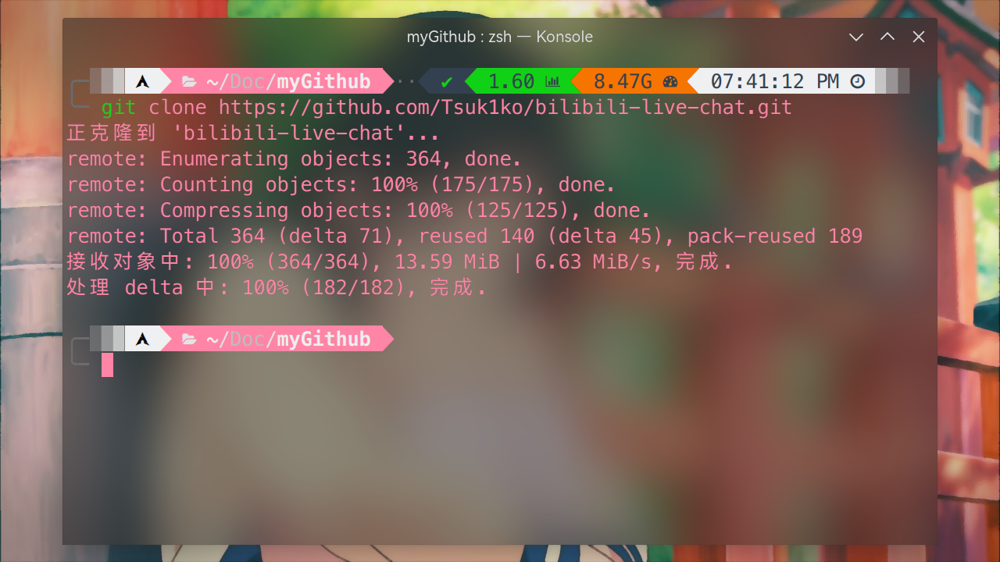

2. 安装 [Node.js](https://archlinux.org/packages/community/x86_64/nodejs/) 和 [Yarn](https://archlinux.org/packages/community/any/yarn/)：

   ```sh
   sudo pacman -S nodejs yarn
   ```

3. 进入克隆仓库并安装项目的所有依赖项：

   ```sh
   cd bilibili-live-chat
   yarn install
   ```

   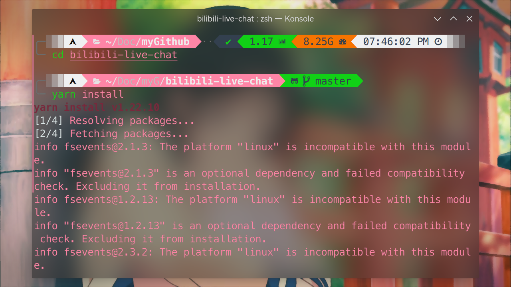

4. 运行本地服务器：

   ```sh
   yarn serve
   ```

   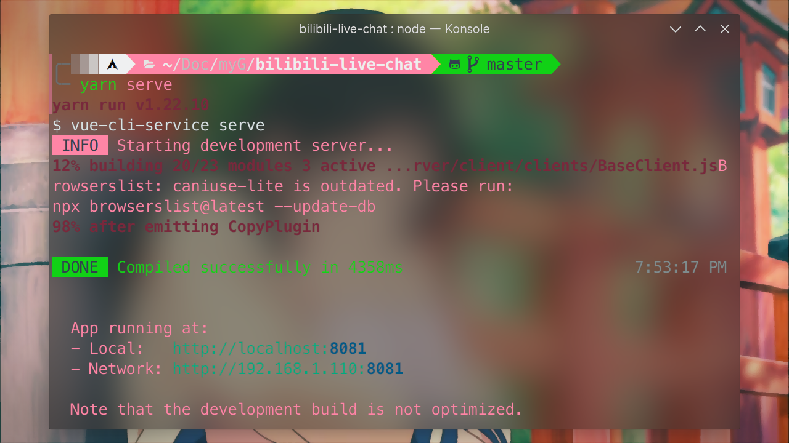

   ::: tip ℹ️ 提示

   也可以使用 `yarn build` 进行编译。这将在 `dist/` 目录产生一个可用于生产环境的包，再将其部署在服务器上。

   更多信息可参阅 [Vue CLI 官方文档](https://cli.vuejs.org/zh/guide/cli-service.html#cli-%E6%9C%8D%E5%8A%A1)。

   :::

5. 打开对应本地链接并设置 > 点击 `Go!`：

   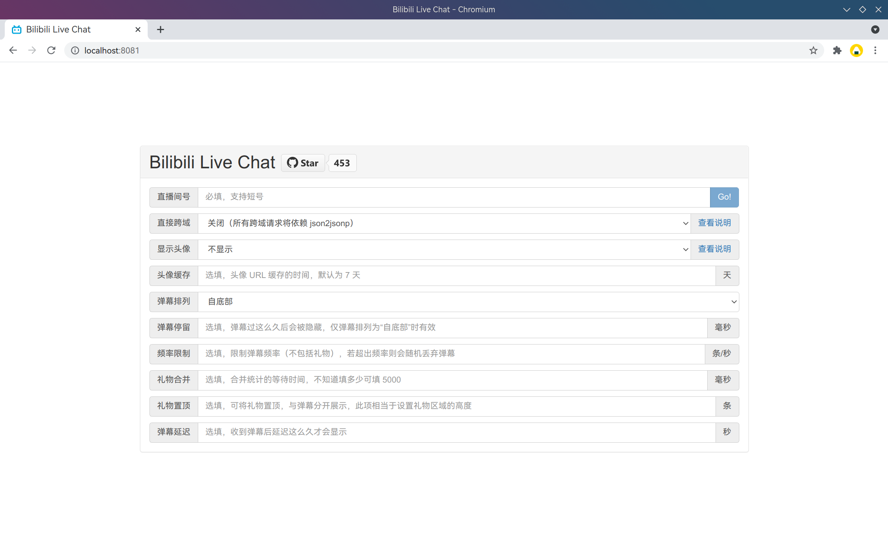

   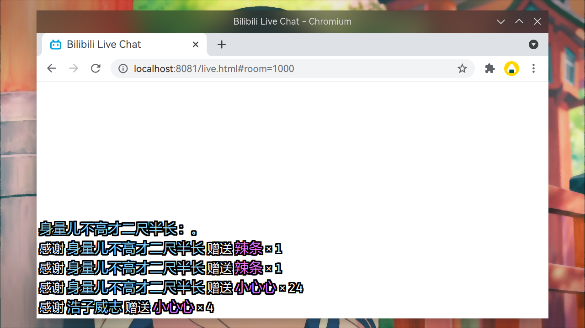

6. 打开 [`OBS Studio`](./vedio.md#obs-studio) > 在 `来源` 中添加 `🌏 浏览器`（BrowserSource）> 复制上方链接填写在 `URL`中。`宽度` 和 `高度` 可根据需要自行设置（不要在预览视图中拖拽缩放浏览器源的宽高），其它选项默认即可：

   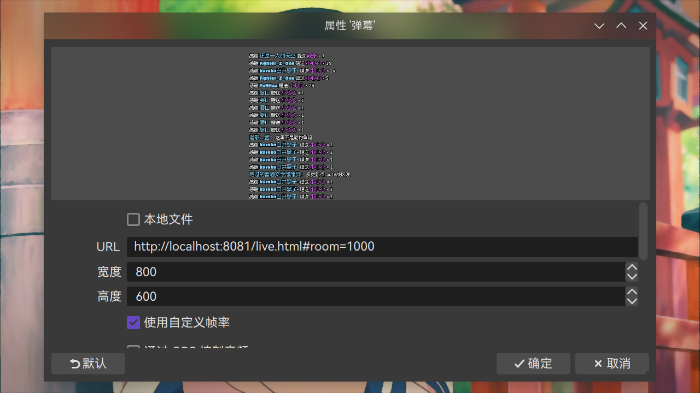

   ::: tip ℹ️ 提示

   Bilibili Live Chat 需要使用 [有浏览器插件集成的 OBS Studio](https://aur.archlinux.org/packages/obs-studio-browser)。

   :::

7. 在预览视图中将其移动至合适位置即可：

   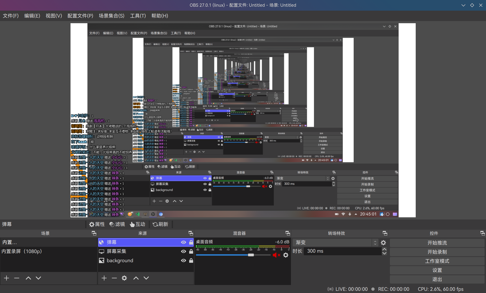

### 弹幕库（推荐）

[弹幕库](https://www.danmaku.live/) 是一个哔哩哔哩直播助手。目前已经 [停止更新](https://t.bilibili.com/378501835576827480)。

1. 安装 [弹幕库](https://www.danmaku.live/)<sup>cn / aur</sup>：

   :::: code-group
   ::: code-group-item cn

   ```sh
   sudo pacman -S bilibili-live-helper-bin
   ```

   :::
   ::: code-group-item aur (git)

   ```sh
   yay -S aur/bilibili-live-helper-bin
   ```

   :::
   ::: code-group-item aur (git)

   ```sh
   yay -S bilibili-live-helper-git
   ```

   :::
   ::::

   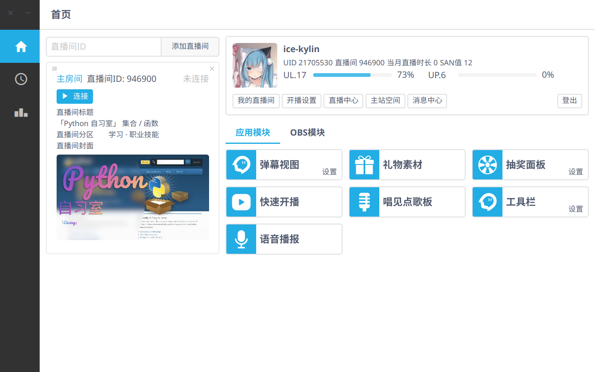

2. 点击 `应用模块` 或 `OBS 模块` 所需功能即可开启 / 设置对应功能，按照提示操作即可：

   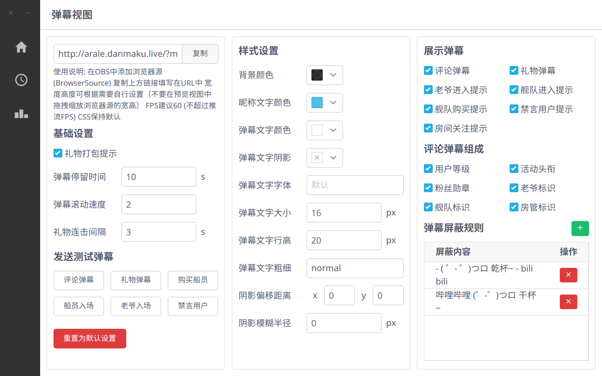

### screenkey

[screenkey](https://www.thregr.org/~wavexx/software/screenkey/) 是一个用于显示键盘键入在屏幕上的工具，可用于录屏演示。

1. 安装 [screenkey](https://archlinux.org/packages/community/any/screenkey/)<sup>community / aur</sup>：

   :::: code-group
   ::: code-group-item community

   ```sh
   sudo pacman -S screenkey
   ```

   :::
   ::: code-group-item aur (git)

   ```sh
   yay -S screenkey-git
   ```

   :::
   ::::

2. 在终端输入 `screenkey` 以启动：

   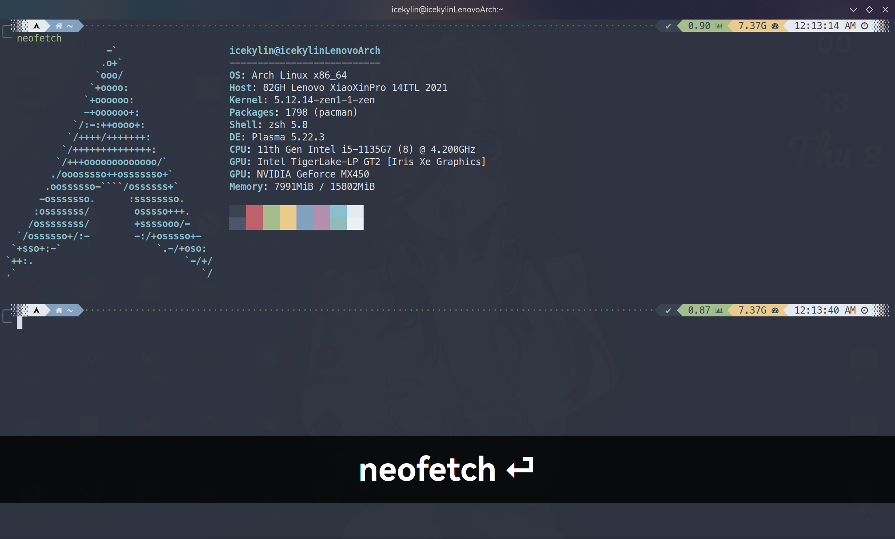

3. 按下 `Ctrl` + `C` 即可退出

::: tip ℹ️ 提示

可以通过以下设置在录屏演示中突出显示鼠标位置与点击效果：

打开 `系统设置` > 点击侧边栏 `工作区行为` > `桌面特效` > 在 `无障碍功能` 中勾选 `鼠标定位` 与 `鼠标点击动效` > `应用`。

:::

## 🔤 字幕制作

视频字幕除了可以用上述视频编辑软件制作，还可以使用 [ffmpeg](https://ffmpeg.org/)（已经作为依赖安装）在命令行进行烧录。

### ffmpeg

一般情况来讲，一个视频加上外带的 \*.srt 字幕是较为普遍的情况。这里描述如何为 YouTube 视频加入字幕。

1. 首先要进行视频字幕的下载。这里可以使用一个 Chromium 浏览器拓展 —— [YouTube™ 双字幕](https://chrome.google.com/webstore/detail/youtube-dual-subtitles/hkbdddpiemdeibjoknnofflfgbgnebcm)

2. 接下来进行字幕与视频的重新烧录。[MKVToolNix](./vedio.md#mkvtoolnix) 只能做那种分离的字幕，但是某些视频网站要上传烧录好的。为了更好的兼容性，建议始终将视频和文件重新烧录。使用 `ffmpeg` 进行操作：

   ```bash
   ffmpeg -i input.mp4 -vf subtitles=input.srt output.mp4
   ```

   ::: tip ℹ️ 提示

   如果需要制作双语字幕（同时显示，而不是分字幕轨道），可以使用两次 `ffmpeg` 命令 —— 第一次添加主字幕，第二次添加副字幕。

   1. 第一次添加主字幕。使用 MarginV 进行垂直方向的区分：

   ```sh
   ffmpeg -i input.mp4 -strict -2 -vf subtitles=input_zh.srt:force_style='Fontsize=20\,Fontname=FZYBKSJW--GB1-0\,MarginV=30\,Bold=-1\,BorderStyle=1' -qscale:v 3 output_with_zh.mp4
   ```

   2. 第二次添加副字幕：

   ```sh
   ffmpeg -i output_with_zh.mp4 -strict -2 -vf subtitles=input_en.srt:force_style
   ='Fontsize=15\,Fontname=FZYBKSJW--GB1-0\,Bold=-1\,BorderStyle=1' -qscale:v 3 output_with_double_subtitles.mp4
   ```

   更多参数可以参阅 [ffmpeg 文档](https://ffmpeg.org/ffmpeg.html)。

   :::
