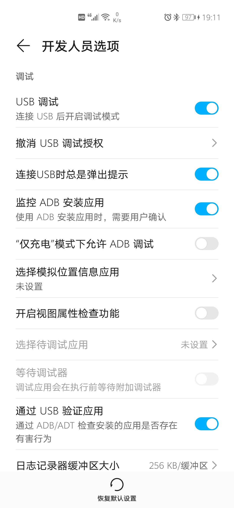
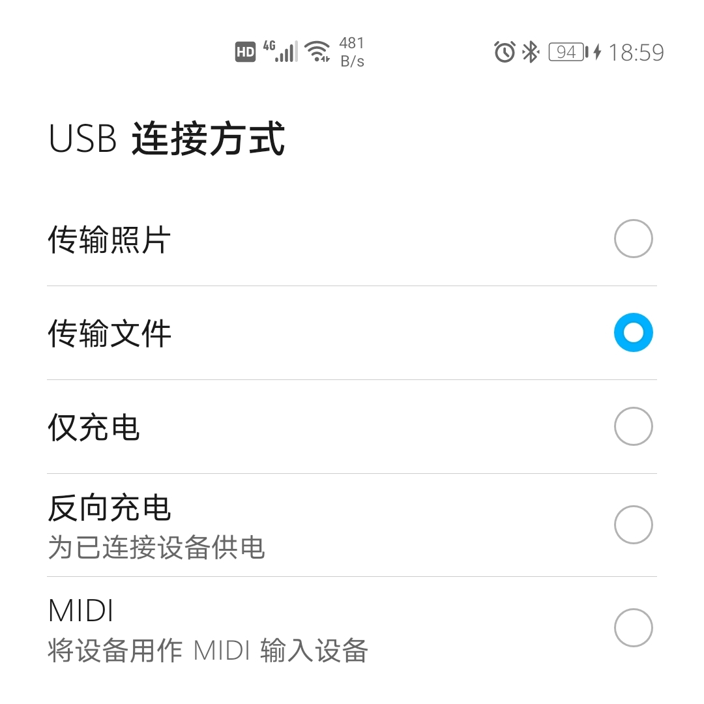
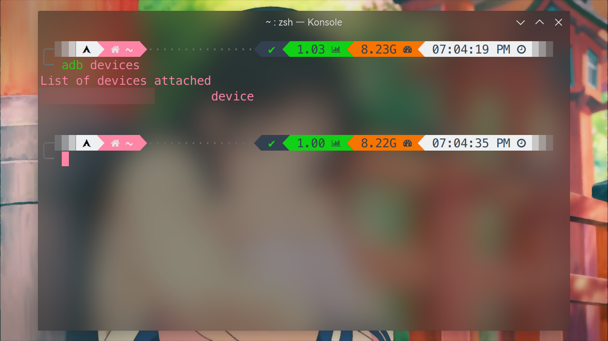
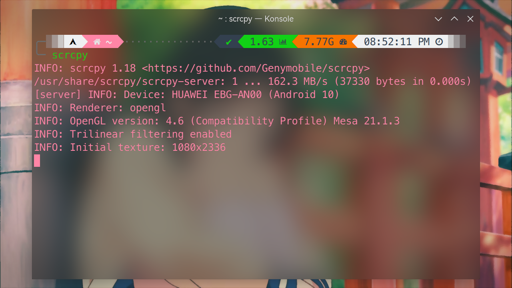
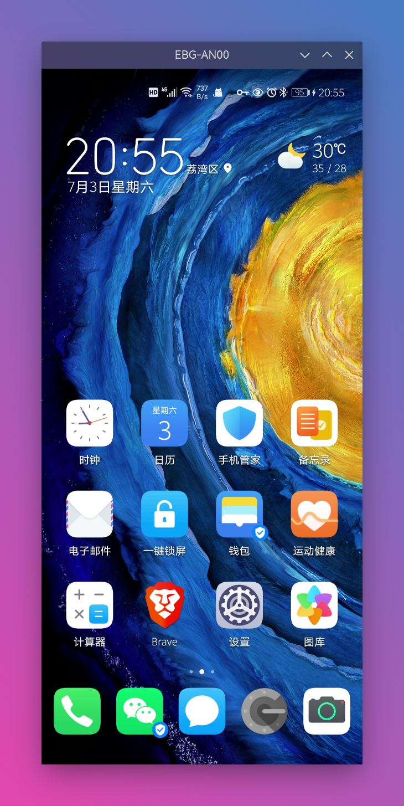
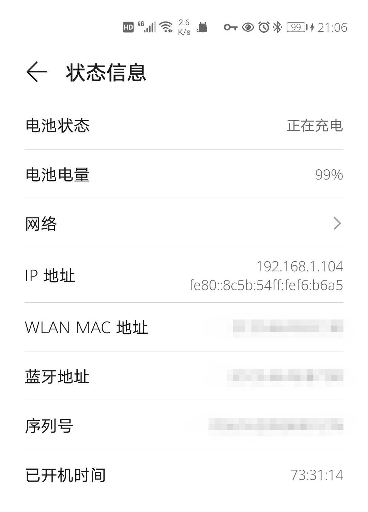
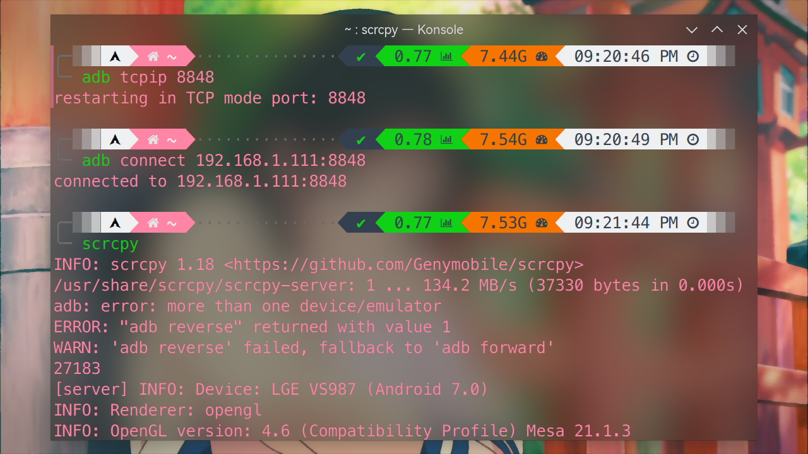
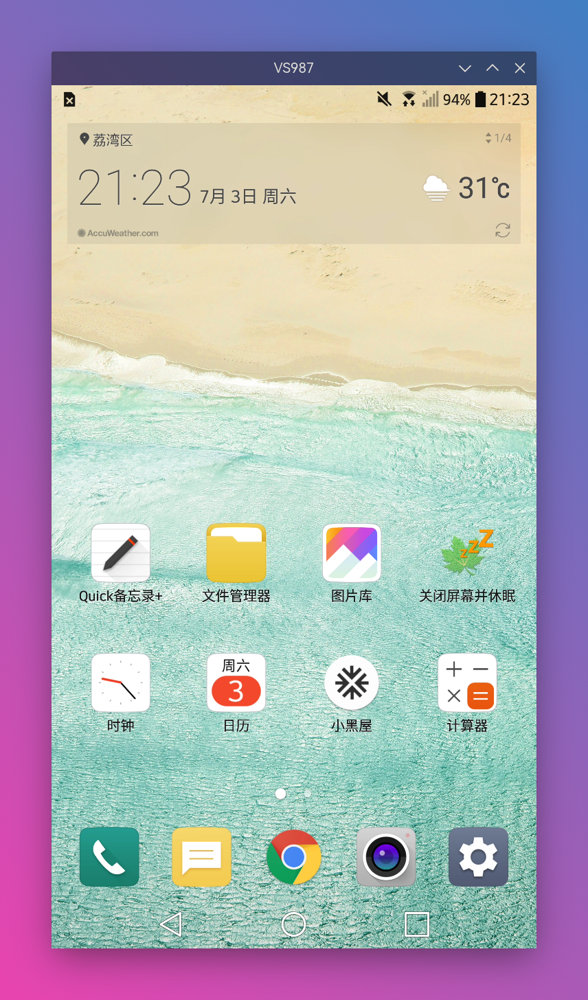
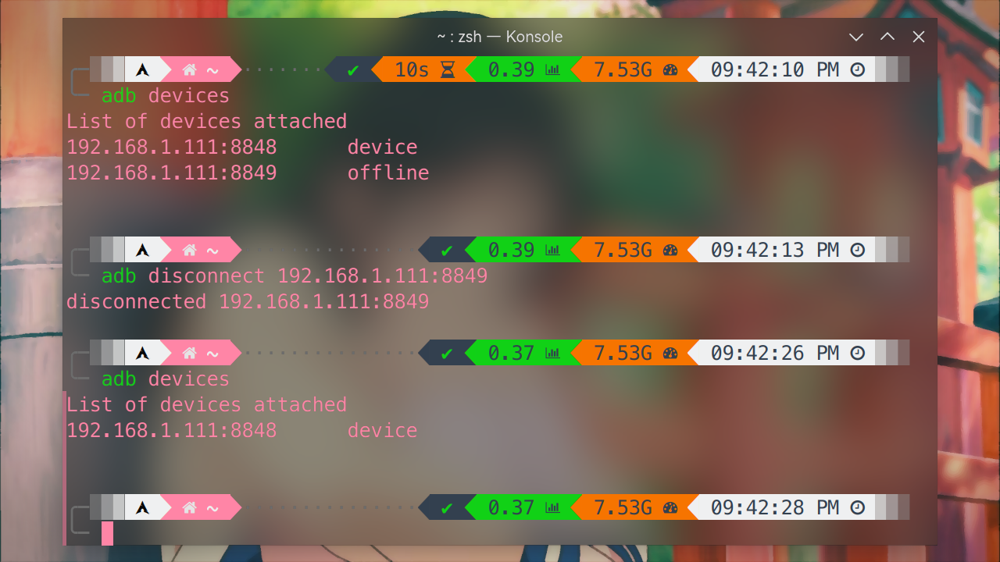

# 多屏协同

> ### 📲 二人同心，其利断金
>
> 本小节内容讨论如何投屏安卓或苹果设备到 archlinux 上以及安卓设备如何和 archlinux 协同工作。

> ### 🔖 这一节将会讨论：
>
> ::: details 目录
>
> [[toc]]
>
> :::

::: tip ℹ️ 提示

指南中带有 <sup>aur</sup> 角标的软件代表是在 [AUR](https://aur.archlinux.org/)（Arch User Repository）中用户自行打包的软件。不在 arch 官方支持范围内，可能会出现各种问题如更新不及时、无法安装、使用出错等。

指南中带有 <sup>cn</sup> 角标的软件代表是在 [archlinuxcn](https://www.archlinuxcn.org/archlinux-cn-repo-and-mirror/)（Arch Linux 中文社区仓库）中用户自行打包的软件。不在 arch 官方支持范围内，可能会出现各种问题如更新不及时、无法安装、使用出错等。

指南中带有 <sup>EULA</sup> 角标的软件代表是 [专有软件](https://www.gnu.org/proprietary/proprietary.html)。请自行斟酌是否使用。

:::

## 🤖 安卓设备投屏（scrcpy）

[scrcpy](https://github.com/Genymobile/scrcpy/blob/master/README.zh-Hans.md) 可以显示并控制通过 USB 或无线连接的安卓设备，且不需要任何 root 权限。

scrcpy 有以下优点：

- 轻量（原生，仅显示设备屏幕）
- 性能（30 ~ 60fps）
- 质量（分辨率可达 1920×1080 或更高）
- 低延迟（35 ~ 70ms）
- 快速启动（最快 1 秒内即可显示第一帧）
- 无侵入性（不会在设备上遗留任何程序）

::: tip ℹ️ 提示

安卓版本要大于等于 5.0。

:::

1. 安装 [scrcpy](https://aur.archlinux.org/packages/scrcpy/)<sup>cn / aur</sup> 以及 [安卓工具包](https://archlinux.org/packages/community/x86_64/android-tools/)：

   :::: code-group
   ::: code-group-item cn

   ```sh
   sudo pacman -S scrcpy android-tools
   ```

   :::
   ::: code-group-item aur

   ```sh
   yay -S aur/scrcpy android-tools
   ```

   :::
   ::: code-group-item aur（git）

   ```sh
   yay -S scrcpy-git android-tools
   ```

   :::
   ::::

2. 打开安卓设备的 `设置` > `开发人员选项`（多次点击 `关于手机（平板）` 中的 `版本号`，提示处在 `开发者模式` 后即可在设置中找到）> 打开 `USB 调试`：

   

   ::: tip ℹ️ 提示

   部分设备还需要开启 `USB 调试（安全设置）`。

   :::

3. 通过数据线连接安卓设备和计算机 > 将 `USB 连接方式` 改为 `传输文件`：

   

4. 在终端执行以下命令：

   ```sh
   adb devices
   ```

   终端上也会显示连接的安卓设备号：

   

   ::: tip ℹ️ 提示

   如果是第一次执行这条命令（或没有永远信任计算机），在安卓设备上应该会出现一个确认使用该电脑调试安卓设备的通知，确认即可。

   :::

   ::: tip ℹ️ 提示

   有些设备可能会自动关闭 `USB 调试`，若没有显示请确认 `USB 调试` 开启。

   :::

### 有线连接

1. 保持数据线连接，直接在终端执行以下命令即可：

   ```sh
   scrcpy
   ```

   

   

2. 关闭窗口即可结束连接

### 无线连接

1. 保持数据线连接，执行以下命令：

```sh
adb tcpip 8848 # 可自定义端口，默认为 5555
```

2. 开启成功之后就可以拔掉数据线了

3. 打开安卓设备的 `设置` > `关于手机（平板）` > `状态信息`（或类似位置）> 查看手机（平板）的 `IP 地址`：

   

4. 在终端执行以下命令即可看到现在的安卓设备界面了：

   ```sh
   adb connect ANDROID_IP:8848 # 刚刚自定义的端口
   ```

   ::: tip ℹ️ 提示

   部分设备可能无法通过无线连接（断开数据线后会自动关闭 `USB 调试`），会显示以下错误信息：

   ```sh
   failed to connect to 192.168.x.xxx:xxxx
   ```

   :::

5. 连接成功后在终端执行以下命令即可看到现在的安卓设备界面了：

   ```sh
   scrcpy
   ```

   

   

   ::: tip ℹ️ 提示

   若报以下错误：

   ```sh
   adb: error: failed to get feature set: more than one device/emulator
   ```

   请执行以下命令后再尝试：

   1. 通过 `adb devices` 命令查看信息，找到不存在的设备（显示为 `offline`，因连接失败留下的）

   2. 断开不存在的设备：

      ```sh
      adb disconnect HOST:PORT
      ```

      

   :::

6. 关闭窗口即可结束连接

### 快捷使用

#### 常用快捷键

| 作用                                 | 快捷键                 |
| :----------------------------------- | :--------------------- |
| 返回                                 | `meta` + `B`           |
| 主界面                               | `meta` + `H`           |
| 多任务界面                           | `meta` + `S`           |
| 关闭手机屏幕（电脑上的界面正常显示） | `meta` + `O`           |
| 开启手机屏幕                         | 右键单击               |
| 展开通知栏                           | `meta` + `N`           |
| 折叠通知栏                           | `meta` + `Shift` + `N` |

#### 文件传输

若需要将计算机的文件传到安卓设备，直接将文件拖拽到计算机上的安卓设备界面即可。文件默认存放在用户的主目录下。

若感觉不太方便可使用 [KDE Connect](./collaboration.md#kde-connect) 协同 scrcpy 使用。

#### 屏幕常亮

在连接到电脑之后很可能都希望手机息屏而计算机端的镜像可以常亮，虽然可以通过键盘快捷键 `meta` + `O` 来实现，但这种方式实现的亮屏会在达到手机屏幕休眠时间之后自动黑屏。

所以想要实现常亮的话需要在启动 scrcpy 的时候添加一个可以保持屏幕唤醒的参数：

```sh
scrcpy --turn-screen-off --stay-awake
```

若亮屏是常用选项，可将这个命令设置为 scrcpy 的别名（alias）。只需要使用以下命令在 `~/.zshrc` 或者 `~/.bashrc` 中添加如下内容，然后重新打开终端或者 `source` 该文件即可：

:::: code-group
::: code-group-item bash

```sh
echo 'alias scrcpy="scrcpy --turn-screen-off --stay-awake"' >> ~/.bashrc
```

:::
::: code-group-item zsh

```sh
echo 'alias scrcpy="scrcpy --turn-screen-off --stay-awake"' >> ~/.zshrc
```

:::
::::

## 🍎 苹果设备投屏（UxPlay）

::: details 视频指南（视频不清晰请前往哔哩哔哩观看）

<div
  style="
    position: relative;
    padding: 30% 45%;
    margin-top: 32px;
  "
>
  <iframe
    style="position: absolute; width: 100%; height: 100%; left: 0; top: 0"
    src="//player.bilibili.com/player.html?aid=972705991&bvid=BV1fp4y1t71r&cid=328263624&page=1&as_wide=1&high_quality=1&danmaku=1"
    scrolling="no"
    border="0"
    frameborder="no"
    framespacing="0"
    allowfullscreen="true"
  ></iframe>
</div>

:::

## 🔗 KDE Connect

---

> 📔 本节参考资料：
>
> - [Android 手机投屏到 Linux 下](https://www.dianbanjiu.com/post/android-%E6%89%8B%E6%9C%BA%E6%8A%95%E5%B1%8F%E5%88%B0-linux-%E4%B8%8B/)
