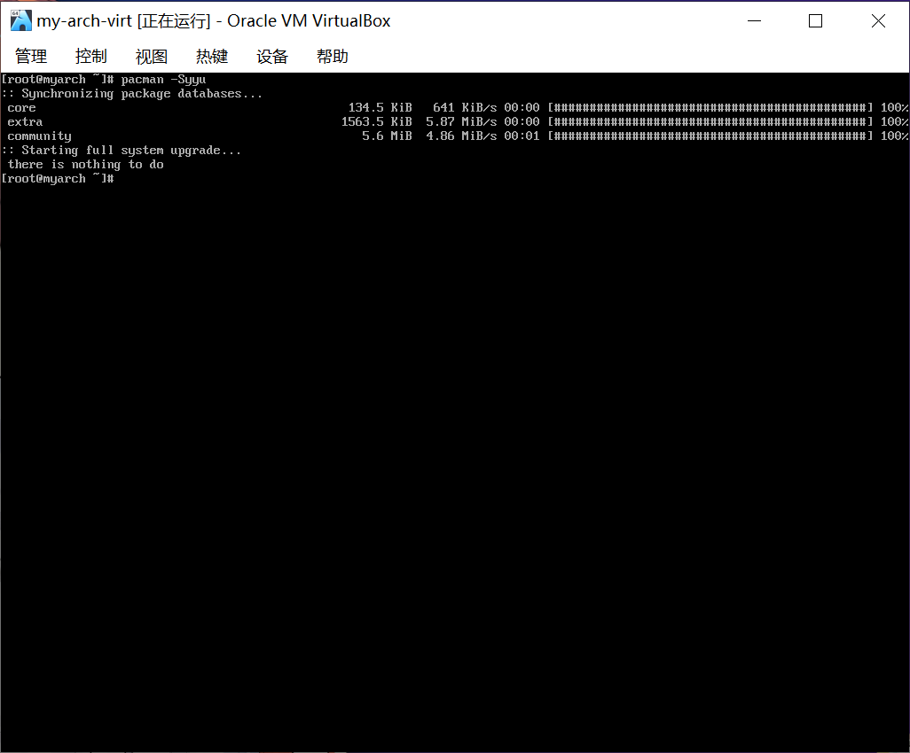

# 桌面环境与常用应用

> ### 🏔 两岸猿声啼不住，轻舟已过万重山
>
> 没有图形界面的 archlinux 显然作为日常使用的操作系统是不合适的。但经过这一节的安装和配置后，我们的系统就可以当作日常的操作系统使用了

> ### 🔖 这一节将会讨论：
>
> 1. 安装桌面环境和常用应用

这一小节，我们开始着手安装桌面环境和一些常用的软件。如有需要可以参阅 [archWiki 一般性建议](<https://wiki.archlinux.org/title/General_recommendations_(%E7%AE%80%E4%BD%93%E4%B8%AD%E6%96%87)>)。

::: tip ℹ️ 提示

指南中带有 <sup>AUR</sup> 角标的软件代表是在 [AUR](https://aur.archlinux.org/)（Arch User Repository）中用户自行打包的软件。不在 arch 官方支持范围内，可能会出现各种问题。

:::

## 1. 确保系统为最新

如果你在做完章节 [archlinux 基础安装](./basic-install.md) 的内容后，关机并放置过一段时间，那么需要先按照 [18. 完成安装](/basic-install.html#_18-完成安装) 中连接网络的方法重新连网，然后使用以下命令更新系统：

```bash
pacman -Syyu # 升级系统中全部包
```



## 2. 准备非 root 用户

1. 通过以下命令添加用户，比如新增加的用户叫 myusername：

```bash
useradd -m -G wheel -s /bin/bash myusername
```

> 📑 命令参数说明：
>
> - `-m` 创建用户的同时创建用户家目录
> - `-G` 选项后指定附加组
>   - `wheel` —— `wheel` 附加组可 `sudo` 进行提权
> - `-s` 选项后指定 shell 程序
> - `myusername` —— 用户名（**请自定义**，但不要包含空格和特殊字符）

2. 通过以下命令根据提示设置新用户 `myusername` 的密码：

```bash
passwd myusername
```

3. 使用 `vim` 编辑器编辑 `sudo` 文件：

```bash
EDITOR=vim visudo
```

4. 找到如下这样的一行，把前面的注释符号 `#` 去掉：

```sudoers
#%wheel ALL=(ALL) ALL
```

> 📑 这里稍微解释一下：
>
> - `%wheel` —— 用户名或用户组，此处则代表是 `wheel` 组，`%` 是用户组的前缀
> - `ALL=` —— 主机名，此处则代表在所有主机上都生效（如果把同样的 `sudoers` 文件下发到了多个主机上）
> - `(ALL)` —— 用户名，此处则代表可以成为任意目标用户
> - 最后的 `ALL` —— 代表可以执行任意命令
>
> 几个更详细的例子:
>
> 1. 在 `mailadmin` 组里的用户可以作为 `root` 用户，在 `snow` 和 `rain` 这两台主机执行一些邮件服务器控制命令（命令之间用 `,` 分隔）：
>
> ```sudoers
> %mailadmin  snow,rain=(root)  /usr/sbin/postfix, /usr/sbin/postsuper, /usr/bin/doveadm
> ```
>
> 2. 用户 `whoami` 可以在所有主机上以 `root` 用户不输入密码执行 `rndc reload` 这条命令（正常来说 `sudo` 都是要求输入调用方的密码的）：
>
> ```sudoers
> whoami  ALL=(root)  NOPASSWD: /usr/sbin/rndc reload
> ```
>
> 3. 当在 `users` 组里的用户以 `sudo passwd` 或者 `sudo passwd root` 方式运行命令的时候，可以直接把 `root` 用户的密> 码 改掉，这真是太危险了！必须要把这两条命令禁止掉，但我们又希望用户可以通过 `sudo passwd` 修改其它用户的密码。那么我们可以在命令前面加上 `!` 来表示不可执行的命令：
>
> ```sudoers
> %users  ALL=(root)  !/usr/bin/passwd, /usr/bin/passwd [A-Za-z]*, !/usr/bin/passwd root
> ```
>
> 总结一下，语法如下：
>
> ```sudoers
> 用户名/%用户组名 主机名=(目标用户名) 命令1, 命令2, !命令3
> ```

5. 保存并退出 `vim` 编辑器

## 3. 安装 KDE Plasma 桌面环境

```bash
pacman -S plasma-meta konsole dolphin # 安装 plasma-meta 元软件包以及 konsole 终端模拟器和 dolphin 文件管理器
```

## 4. 配置 greeter sddm

```
systemctl enable sddm
```

## 5. 开启 32 位支持库与 Arch Linux 中文社区仓库（archlinuxcn）

1. 编辑 `/etc/pacman.conf` 文件：

```bash
vim /etc/pacman.conf
```

2. 去掉 `[multilib]` 一节中两行的注释，来开启 32 位库支持

3. 在文档结尾处加入下面的文字，来添加 `archlinuxcn` 源。推荐的镜像源（选一个即可）也一并列出：

```pacman.conf {2}
[archlinuxcn]
Server = https://mirrors.ustc.edu.cn/archlinuxcn/$arch # 中国科学技术大学开源镜像站
Server = https://mirrors.tuna.tsinghua.edu.cn/archlinuxcn/$arch # 清华大学开源软件镜像站
Server = https://mirrors.hit.edu.cn/archlinuxcn/$arch # 哈尔滨工业大学开源镜像站
Server = https://repo.huaweicloud.com/archlinuxcn/$arch # 华为开源镜像站
```

::: tip ℹ️ 提示

此外，还有其它镜像源在 [archlinuxcn 官方 Github Repo](https://github.com/archlinuxcn/mirrorlist-repo#arch-linux-cn-community-repo-mirrors-list) 列出，可以根据自己实际情况另行选择。

archlinuxcn 仓库服务器位于欧洲，在中国大陆、中国香港、美国有镜像。

:::

4. 保存并退出 `vim` 编辑器

5. 通过以下命令刷新 `pacman` 数据库并更新：

```bash
pacman -Syyu
```

6. 通过以下命令重启电脑，即可看到欢迎界面：

```bash
reboot
```

7. 输入新用户的密码即可登录桌面

## 7. 安装基础功能包

1. 进入桌面后，搜索 `konsole`。它是 KDE 桌面环境默认的终端模拟器。

2. 首先先进行桌面环境中的网络设置：

```bash
sudo systemctl disable iwd # 确保 iwd 开机处于关闭状态，因为其无线连接会与 NetworkManager 冲突
sudo systemctl stop iwd # 立即关闭 iwd
sudo systemctl enable --now NetworkManager # 确保先启动 NetworkManager，并进行网络连接。若 iwd 已经与 NetworkManager 冲突，则执行完上一步重启一下电脑即可
```

3. 接下来安装一些基础功能包：

```bash
sudo pacman -S ntfs-3g # 识别 NTFS 格式的硬盘
sudo pacman -S adobe-source-han-serif-cn-fonts wqy-zenhei # 安装几个开源中文字体。一般装上文泉驿就能解决大多 wine 应用中文方块的问题
sudo pacman -S noto-fonts noto-fonts-cjk noto-fonts-emoji noto-fonts-extra # 安装谷歌开源字体及表情
sudo pacman -S firefox chromium # 安装常用的火狐、chromium 浏览器
sudo pacman -S ark # 压缩软件。在 dolphin 中可用右键解压压缩包
sudo pacman -S packagekit-qt5 packagekit appstream-qt appstream # 确保 Discover（软件中心）可用，需重启
sudo pacman -S gwenview # 图片查看器
sudo pacman -S steam # 游戏商店。稍后看完显卡驱动章节再使用
```

4. 最后执行安装 `archlinuxcn` 源所需的相关步骤：

```bash
sudo pacman -S archlinuxcn-keyring # cn 源中的签名（archlinuxcn-keyring 在 archlinuxcn）
sudo pacman -S yay # yay 命令可以让用户安装 AUR 中的软件（yay 在 archlinuxcn）
```

::: tip ℹ️ 提示

若安装 `archlinuxcn-keyring` 时报错，是由于密钥环的问题。可先按照 [archlinuxcn 官方说明](https://www.archlinuxcn.org/gnupg-2-1-and-the-pacman-keyring/) 执行其中的命令，再安装 `archlinuxcn-keyring`。

:::

## 8. 检查家目录

检查家目录下的各个常见目录是否已经创建，若没有则需通过以下命令手动创建：

```bash
cd ~
mkdir Desktop Documents Downloads Music Pictures Videos
```

## 9. 设置系统为中文

1. 打开 `System Settings` > `Regional Settings` > 在 `Language` 中选择中文加入，再拖拽到第一位 > `Apply`

2. 注销并重新登陆即可

::: tip ℹ️ 提示

很多人会错误的更改 `System Settings` > `Regional Settings` > `Formats` 中的值为中文蒙古、默认或者其他值。这会导致系统中一半英文一般中文。这里的值要保持默认的 `en_US` 或 `zh_CN`，或者改为你在 `locale.gen` 中添加的任意一种语言。

:::

## 10. 安装输入法

如有需要可以参阅 [Fcitx5 官方文档](<https://wiki.archlinux.org/index.php/Fcitx5_(%E7%AE%80%E4%BD%93%E4%B8%AD%E6%96%87)>)。

1. 通过以下命令安装相关软件包：

```bash
sudo pacman -S fcitx5-im # 输入法基础包组
sudo pacman -S fcitx5-chinese-addons # 官方中文输入引擎
sudo pacman -S fcitx5-anthy # 日文输入引擎
sudo pacman -S fcitx5-pinyin-moegirl # 萌娘百科词库。二刺猿必备（archlinuxcn）
sudo pacman -S fcitx5-material-color # 输入法主题
```

2. 此外，我们还需要设置环境变量。通过 `vim` 编辑文件 `~/.pam_environment`：

```bash
vim ~/.pam_environment
```

3. 在文件中加入以下内容并保存退出：

```.pam_environment
INPUT_METHOD DEFAULT=fcitx5
GTK_IM_MODULE DEFAULT=fcitx5
QT_IM_MODULE DEFAULT=fcitx5
XMODIFIERS DEFAULT=\@im=fcitx5
SDL_IM_MODULE DEFAULT=fcitx
```

`konsole` 以及 `dophin` 都需要这些环境变量，倒是 Firefox 和 Chromium 都不需要就可以输入中文。

4. 打开 系统设置 > 区域设置 > 输入法，点击 `添加输入法`，找到简体中文下的 `Pinyin`，点击添加即可加入拼音输入法

5. 接下来点击 `Pinyin` 右侧的配置按钮，点选`云拼音`和`在程序中显示预编辑文本` 最后应用

6. 回到输入法设置，点击 `配置附加组件`，找到 _classic user interface_ 在主题里选择一个你喜欢的颜色最后应用

7. 注销并重新登陆，就可以发现已经可以在各个软件中输入中文了

## 11. 启动蓝牙（若有）

通过以下命令开启蓝牙相关服务并设置开机自动启动：

```bash
sudo systemctl enable --now bluetooth
```
