# 安装前的准备

> ### 🧭 凡事预则立，不预则废
>
> 这一章开始，我们正式开始安装 archlinux。但是我们首先要做一些准备工作

> ### 🔖 这一节将会讨论：
>
> 1. 正式安装 archlinux 前需要做的准备

::: tip ℹ️ 提示

由于当前 UEFI 已普及十余年，安装将全部以 `UEFI + GPT` 的形式进行，传统 `BIOS` 方式不再赘述。

:::

## 1. 确保网络环境

如果你可以使用路由器分接出来的网线，以 dhcp 的方式直接上网，那么不用准备什么。如果你的环境只能使用无线网络安装，需要事先把自己所用的 wifi 名称改成自己能记住的英文名称。因为**安装时无法显示和输入中文名的 wifi**，你会看到一堆不知道是什么的方块，并且在安装过程中你将没有办法输入中文的无线名称进行连接。

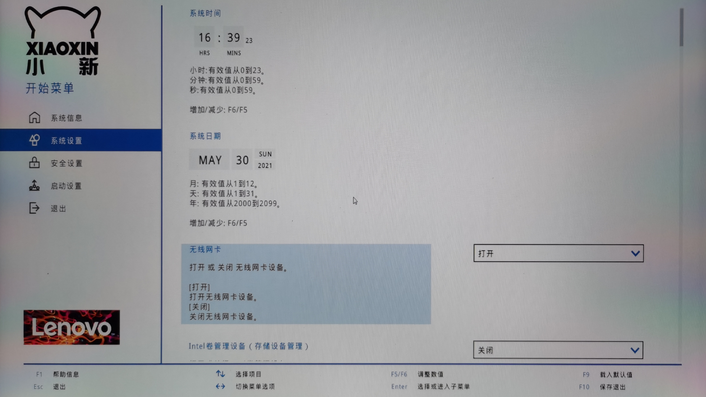

其次，有些笔记本电脑上存在无线网卡的硬件开关或者键盘控制，开机后安装前需要**确保你的无线网卡硬件开关处于打开状态**。

## 2. 下载安装镜像

安装镜像 iso 在开源镜像站（推荐）或者 [archlinux 官方下载页面](https://archlinux.org/download/) 下载。

下面是国内常用的提供 archlinux 安装镜像的开源镜像站（选一个即可）：

- [中国科学技术大学开源镜像站](http://mirrors.ustc.edu.cn/)
- [清华大学开源软件镜像站](https://mirrors.tuna.tsinghua.edu.cn/)
- [华为开源镜像站](https://repo.huaweicloud.com/archlinux/)
- [兰州大学开源镜像站](https://mirror.lzu.edu.cn/archlinux/)

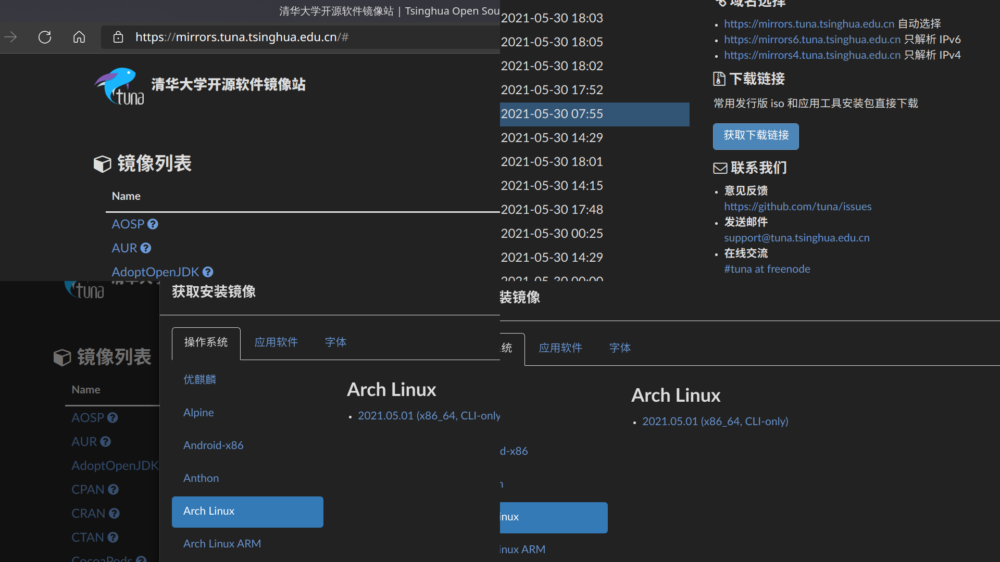

其中前两者点击网页右侧侧栏的获取下载链接，选择 archlinux 下载即可。

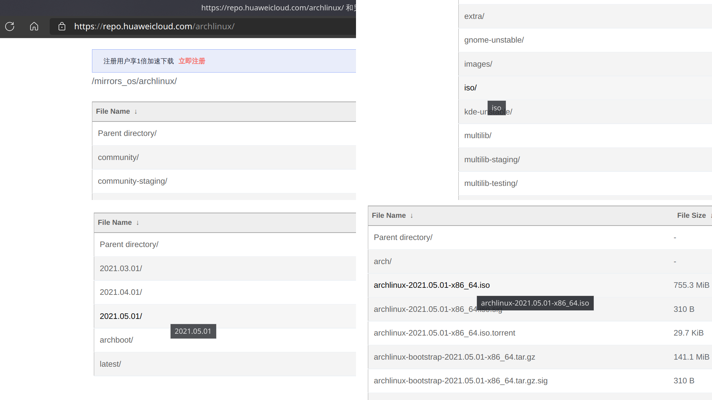

后两者需要依次点击 _iso_ > _20XX.XX.XX_ > _archlinux-20XX.XX.XX-x86_64.iso_。

::: warning ⚠️ 注意

请确保下载最新的安装镜像！因为 archlinux 是滚动发行版，不存在使用旧的安装镜像安装旧版本的说法。

这里也可以看出 archlinux 每月 1 日释出新的安装镜像。

:::

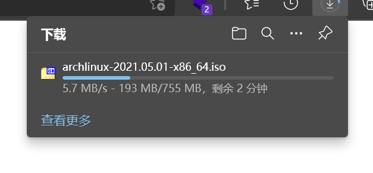

中科大的开源镜像站下载速度还是很快的。

## 3. 刻录安装优盘

准备一个 2G 以上的优盘，刻录一个安装盘。

Windows 下推荐使用 [ventoy](https://www.ventoy.net/cn/doc_start.html)、[Rufus](https://rufus.ie/) 或者 [Power ISO](https://www.poweriso.com/download.php) 进行优盘刻录。三者皆为免费使用的软件。具体操作请自行查阅，都非常简单。

除此之外，如果你还嫌麻烦，还可以使用更为简单的安装盘制作工具 [balenaEtcher](https://www.balena.io/etcher/)。

::: tip ℹ️ 提示

使用 [balenaEtcher](https://www.balena.io/etcher/) 制作完成的安装盘若要重新作为普通优盘使用，需要用磁盘分区管理工具（如 [DiskGenius](https://www.diskgenius.cn/)）重建分区表才能正常格式化。

:::

Linux 下同样可以使用 [ventoy](https://www.ventoy.net/cn/doc_start.html)，也可以直接用 `dd` 命令进行刻录。注意 `of` 的参数为 `sdx`，不是 `sdx1`、`sdx2` 等。

```bash
sudo dd bs=4M if=/path/to/archlinux.iso of=/dev/sdx status=progress oflag=sync
```

> 📑 命令参数说明：
>
> - `bs=4M` 指定一个较为合理的文件输入输出块大小
> - `status=progress` 用来输出刻录过程总的信息
> - `oflag=sync` 用来控制写入数据时的行为特征。确保命令结束时数据及元数据真正写入磁盘，而不是刚写入缓存就返回

## 4. 为 archlinux 分出硬盘空间（可选）

如果是目标是双系统（win10 + archlinux），并且 win10 和 archlinux 将要共存在一个硬盘上的话，往往要在 win10 使用的分区上分出空闲硬盘空间给 archlinux。这里建议**至少分 `128GB` 给 archlinux**。

### 具体步骤


1. 右键点击 _开始菜单_ > _磁盘管理_

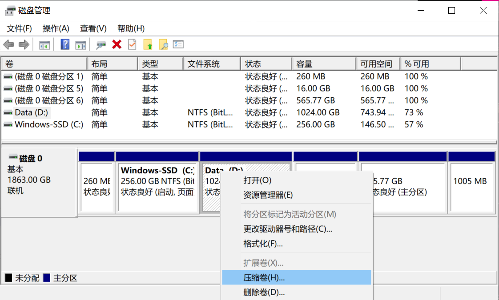

2. 右键点击 _需要压缩的分区_ > _压缩卷_

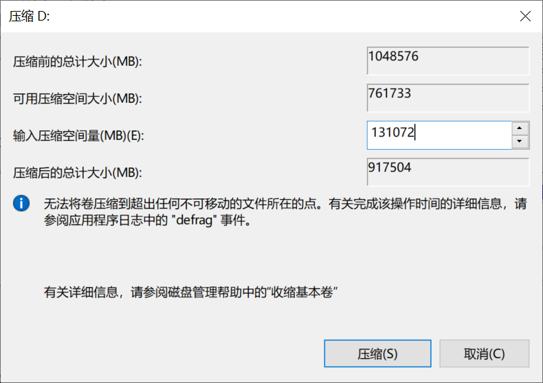

3. 在 _输入压缩空间量(MB)_ 输入需要分给 archlinux 的空闲硬盘空间大小。假设分配 `128GB` 则输入 `131072`（1GB = 1024MB，128GB = 128 \* 1024MB = 131072MB）

4. 点击 _压缩_，完成之后关闭磁盘管理即可

::: warning ⚠️ 注意

请不要做多余的动作！不要在这里为分出的硬盘空间创建分区！

:::

## 5. 进入主板 BIOS 进行设置

插入优盘并开机。在开机的时候，按下 `F2` / `F8` / `F10` / `DEL` 等（取决与你的主板型号，具体请查阅你主板的相关信息）按键，进入主板的 `BIOS` 设置界面。

除此之外，如果你还嫌麻烦，还可以使用以下方法进入 `BIOS`：


1. 在 win10 下 按住 _Shift_ 键同时点击 _重启_

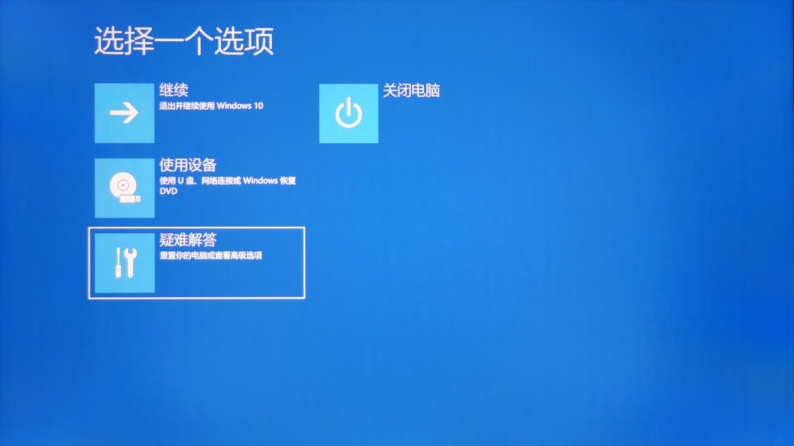

2. 保持按住 _Shift_ 键直到进入如图所示界面

3. 选择 _疑难解答_ 并按下 _Enter_


4. 选择 _UEFI 固件设置_ 并按下 _Enter_


5. 按下 _Enter_ 重启，此时应该已经进入了 `BIOS`

> #### 🍧 碎碎念
>
> 随着时代的发展，主板的 `BIOS` 界面也越来越现代；很多主板都有了中文，根据主板 `BIOS` 界面的提示进行操作吧！

## 6. 关闭主板设置中的 Secure Boot


在类似名为 `security`（安全） 的选项卡中，找到一项名为 `Secure Boot`（安全启动，名称可能略有差异）的选项，选择 `Disable` 将其禁用。

> #### 🍧 碎碎念
>
> 有少数恶心的主板里面，`Secure Boot` 被设置为开启，却不存在关闭它的选项，但系统主板内置有 windows 系统的公钥证书签名，使其只能加载 windows，其它系统（包括 archlinux）一律不予加载。用户不能关闭它，还没法换系统，实在让人无语 😶
>
> 如果你正好是这样的电脑，emmm... 不妨在虚拟机里试下 archlinux 吧！

## 7. 调整启动方式为 UEFI（可能不需要）

在某些旧的主板里，需要调整启动模式为 `UEFI`,而非传统的 `BIOS/CSM`。在类似名为 `boot` 的选项卡中，找到类似名为 `Boot Mode` 的选项，确保将其调整为 `UEFI only`，而非 `legacy/CSM`。

## 8. 调整硬盘启动顺序

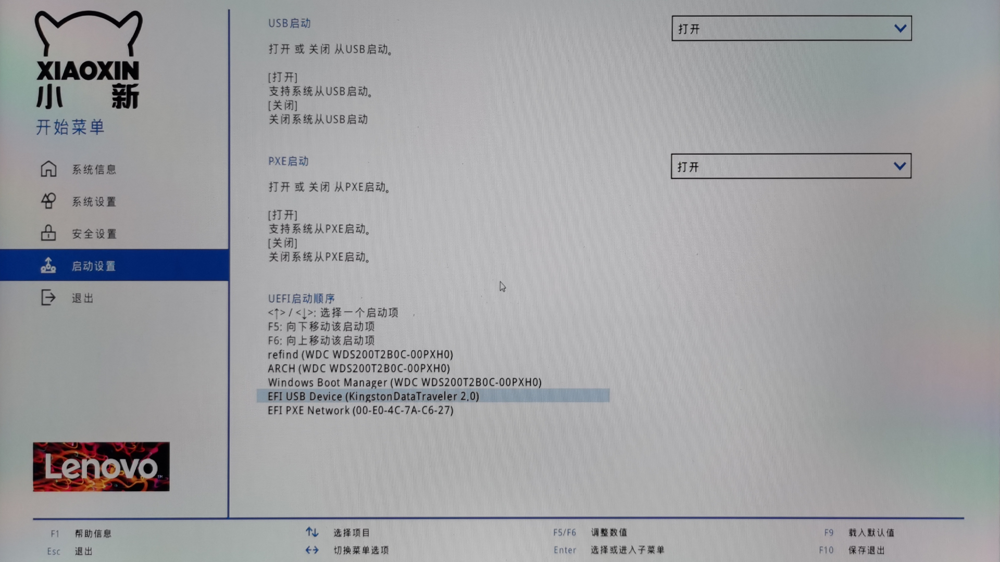


在类似名为 `boot` 的选项卡中，找到类似名为 `Boot Options`（名称可能略有差异）的设置选项，将优盘的启动顺序调至首位。

## 9. 保存 BIOS 设置

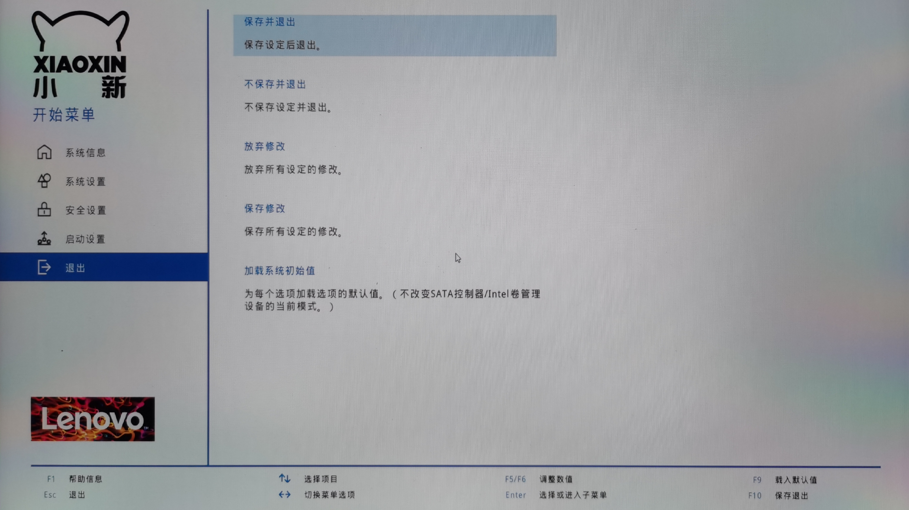

最后保存 BIOS 设置并退出，一般的按键是 `F10`。

## 10. 准备安装

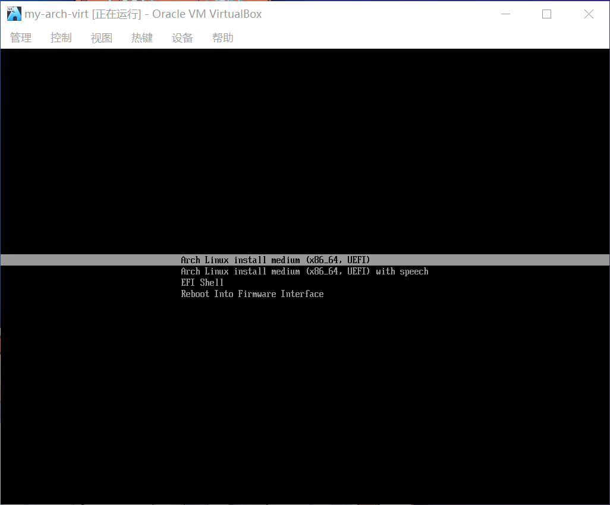

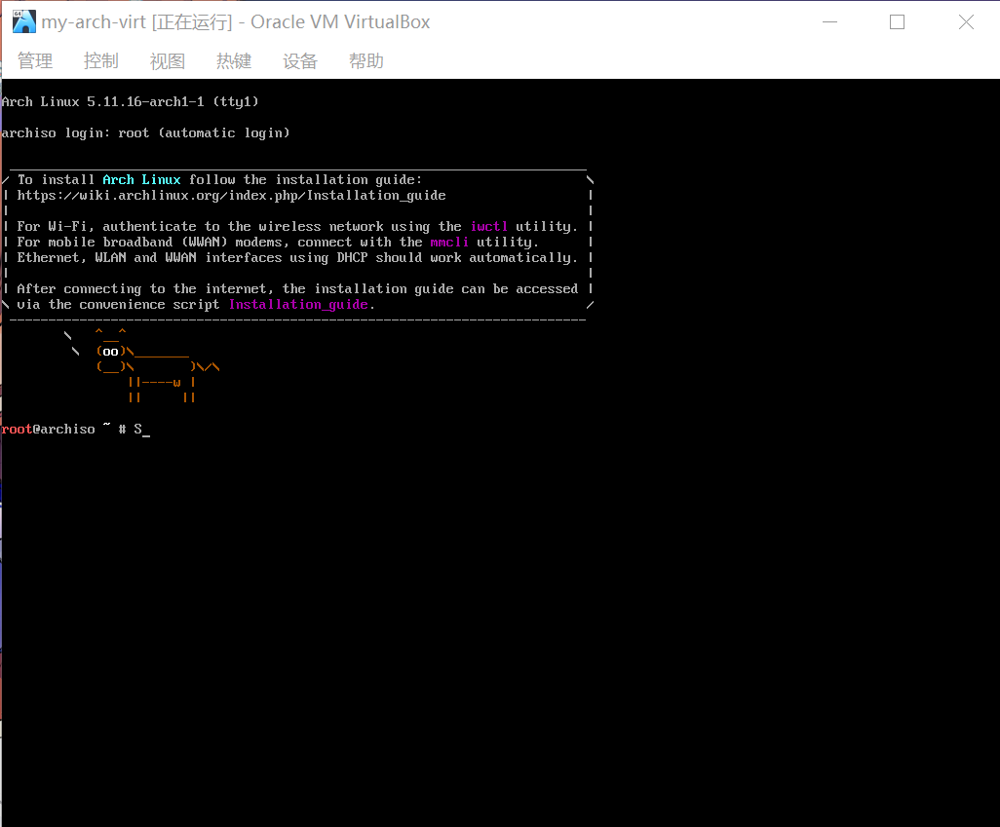

此时电脑重启，不出意外的话根据提示你应该可以顺利进入 archlinux 的安装界面了（有一头 🐄 牛牛在讲话）。

::: tip ℹ️ 提示

archlinux 安装盘应该一直插在 🖥️ 电脑上

:::
